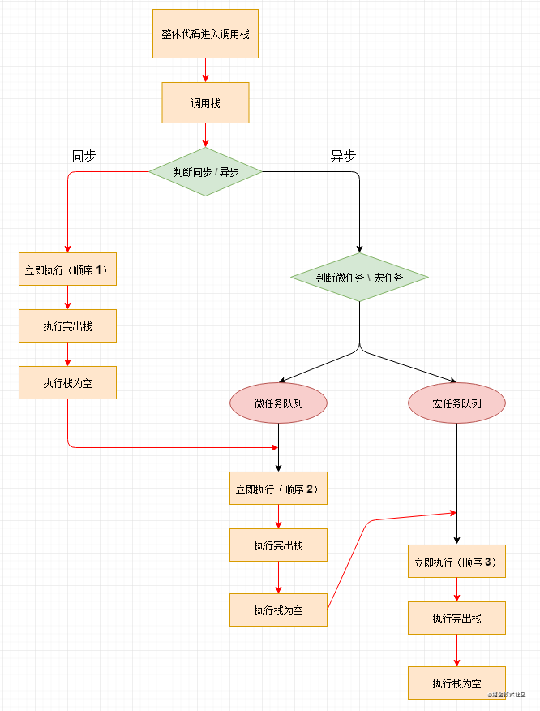

## 单线程的 JS

大家应该都知道 `JS` 有一个特性，在刚开始学习的时候应该就知道了，那就是 `JS` 是**单线程**的。

那么，为什么 `JS` 是单线程的呢，明明多线程能提升效率啊。

其实，这个与它的本身用途也有关系， `JS` 的主要用途是与用户互动，以及操作 `DOM` 。这决定了它只能是单线程，否则会带来很复杂的同步问题。比如，假定 `JS` 同时有两个线程，一个线程在某个 `DOM` 节点上添加内容，另一个线程删除了这个节点，这时浏览器应该以哪个线程为准？

单线程就意味着，所有任务需要排队，前一个任务结束，才会执行后一个任务。如果前一个任务耗时很长，后一个任务就不得不一直等着。

于是，所有任务可以分成两种，一种是同步任务（ `synchronous` ），另一种是异步任务（ `asynchronous` ）。同步任务指的是，在主线程上排队执行的任务，只有前一个任务执行完毕，才能执行后一个任务；异步任务指的是，不进入主线程、而进入”任务队列”（task queue）的任务，只有”任务队列”通知主线程，某个异步任务可以执行了，该任务才会进入主线程执行。

所以，是**单线程的出现，才引发了同步和异步的出现**，接下来，让我们来引入一个生活中的例子，方便大家**更好地理解同步和异步**

## 现实生活中的同步与异步

就比方说我们平时吃 KFC，我们都要去收银台排队，（**别跟我说扫码点餐！**），假设我们点了一份炸鸡 + 付款一分钟，取餐需要五分钟，这个时候店员说，按照我们店里的规定，我们只能一个接一个的服务客户，后面的客户必须等当前这个客户取完餐，才能换下一个客户点餐，而这种情况，那就是所谓的同步，就是按顺序执行，一件事情做完了，才能做下一件事情。

但是结果是很明显的，这种接客方式也未免效率太低了，那 KFC 估计也支撑不到今天就已经倒闭了。

为了提升自己的服务效率，后来，KFC 推出了 `点餐区` 以及 `取餐区` 。在你付款完成以后，给你一张取餐小票，就可以从收银台的队列中出去啦，让下一个客户赶紧点餐，而你只需要等前台通知你，你要的套餐做好啦，快来取餐区取餐啦。

## JS 中的同步与异步

* ### 同步

  任务从上往下按顺序执行，后一个任务必须等待前一个任务执行完（后一个点餐的人必须要等前一个人取完餐）

* ### 异步

  前一个任务还没执行完（前一个人还没取完餐）, 也没关系，直接执行下一个任务（让下一个客户点餐），等到前台通知取餐，在执行（取餐）

经过同步任务和异步任务的划分，程序的运行效率明显提高了（KFC 的接待效率）

## 微任务与宏任务

上面已经对同步任务和异步任务进行了划分，我们都知道，同步任务就是按顺序执行，从上往下。

那么，异步任务也是有它的执行顺序的，它也是**从上往下**，但是，异步任务里，对于异步类型还有进一步的划分，那就是接下来我们要讲的**微任务**和**宏任务**，切记**微任务比宏任务先执行**

* ### 微任务（`micro-task`）

  process.nextTick、Promise、MutationObserver 等

* ### 宏任务（`macro-task`）

  setTimeout、setInterval、 setImmediate、script（整体代码）、I/O 操作等

值得注意的是， `Promise` 是有一点特殊性的，因为**Promise 构造函数中函数体的代码都是立即执行的** , 而 `Promise.then()` 和 `Promise.catch()` 属于微任务，也就是 `resolve()` 和 `reject()`

对于上面这句话的理解，可以来看下下面的例子

```javascript copyable
new Promise(function (resolve) {
  console.log(1)
})
复制代码
```

上面这段实例代码的 `1` ，是直接输出的，属于同步任务，虽然它确实在 `Promise` 中

学会如何区分微任务与宏任务之后，我们也就对异步任务的执行顺序划分有了进一步的了解

## 调用栈

这是最后要介绍的一个角色，也就是真正执行代码，执行任务的地方

## Event Loop

1. 初始状态下，调用栈空。微任务队列空，宏任务队列里有且只有一个 script 脚本（整体代码）。这时首先执行并出队的就是 整体代码
2. 整体代码作为宏任务进入调用栈，进行同步任务和异步任务的区分
3. 同步任务**直接执行**并且在执行完之后**出栈**，异步任务进行微任务与宏任务的划分，分别被推入进入**微任务队列**和**宏任务队列**
4. 等同步任务执行完了（调用栈为空）以后，再处理微任务队列，将微任务队列压入调用栈
5. 当调用栈中的微任务队列被处理完了（调用栈为空）之后，再将宏任务队列压入调用栈，直至调用栈再一次为空，一次轮回结束

整体的运行流程可以查看下图，**红色箭头为主要的执行流程**，`整体代码(宏任务) => 同步任务 => 微任务队列 => 宏任务队列`

**虽然整体代码确实是一开始作为宏任务执行的，但是，希望大家还是要切记，在异步任务中，微任务队列比宏任务队列先执行(方便记忆)**



关于这个 `Event Loop` ，其实涉及了很多的知识点，包括 **微任务** ， **宏任务** ， **调用栈** ， **执行上下文** ，**同步与异步** ， **任务队列**

## 文末一题

```javascript copyable
console.log(1)

setTimeout(function() {
  console.log(2)
})

new Promise(function (resolve) {
  console.log(3)
  resolve()
}).then(function () {
  console.log(4)
}).then(function() {
  console.log(5)
})

console.log(6)
复制代码
```

通过上面的学习，这道题就显得十分简单了，答案就是 ` 1 3 6 4 5 2`

不明白的话，可以看看我下面的这一段分析，我们从上往下，将代码抽离成三部分，同步任务，微任务队列以及宏任务队列

* #### 同步任务

```javascript copyable
console.log(1)
console.log(3)
console.log(6)
复制代码
```

* #### 微任务队列

```javascript copyable
console.log(4)    //Promise.then()
console.log(5)    //Promise.then()
复制代码
```

* #### 宏任务队列

```javascript copyable
console.log(2)    //setTimeout
复制代码
```

所以，答案一眼就能看的出来是 ` 1 3 6 4 5 2`
