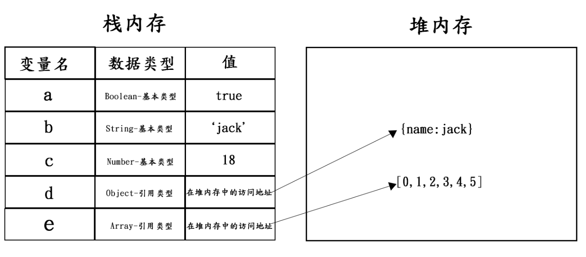
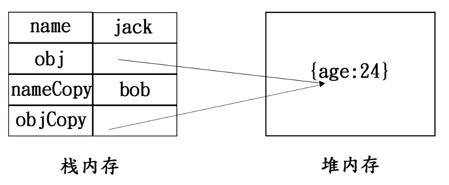

## JS内存生命周期
{: id="20201116171019-13965ou"}

* {: id="20201116171019-fuy0hu3"}#### 分配内存
  {: id="20201116171019-cq3iruo"}
* {: id="20201116171019-50rrmsz"}#### 内存的读与写
  {: id="20201116171019-0i7on8z"}
* {: id="20201116171019-y2fb8bg"}#### 释放内存
  {: id="20201116171019-frdrcln"}
{: id="20201116171019-ny0edvt"}

## 栈内存与堆内存
{: id="20201116171019-5qvmet7"}

### JS数据类型
{: id="20201116171019-byp9npb"}

在讲栈内存与堆内存之前，大家应该都知道JS分为两种数据类型：
{: id="20201116171019-b8siv7j"}

* {: id="20201116171019-fjyv5ad"}#### 基本数据类型
  {: id="20201116171019-525xeq4"}
{: id="20201116171019-jib8tfq"}

String , Number , Boolean , null , undefined , Symbol **（大小固定，体积轻量，相对简单）**
{: id="20201116171019-ok0dpsz"}

* {: id="20201116171019-8u0prqr"}#### 引用数据类型
  {: id="20201116171019-rn2xvcx"}
{: id="20201116171019-36atbwd"}

Object , Array , Function **(大小不一定，占用空间较大，相对复杂)**
{: id="20201116171019-0hy8jnd"}

### 内存存储机制
{: id="20201116171019-2955c31"}

```javascript copyable
var a=true;      //布尔型，基本数据类型
var b='jack';    //字符型，基本数据类型
var c=18;        //数值型，基本数据类型
var d={name:'jack'};   //对象，引用数据类型
var d=[0,1,2,3,4,5];   //数组，引用数据类型
复制代码
```
{: id="20201116171019-dptrygh"}

正是因为数据类型的不同，所以他们的存放方式也不同，就和现实生活中穷人和富人的住所完全不一样（扯远了）。我们先来看一张图：
{: id="20201116171019-2nw6r8v"}


{: id="20201116171019-odu8h43"}

可以看到， `a` , `b` , `c` 都是基本数据类型， `d` 和 `e` 都是引用数据类型，他们在存放方式上有着本质性的区别，**基本数据类型的值是存放在栈内存中的，而引用数据类型的值是存放在堆内存中的，栈内存中仅仅存放着它在栈内存中的引用（即它在堆内存中的地址），就和它的名字一样，引用数据类型**
{: id="20201116171019-2sblmbr"}

### 内存访问机制
{: id="20201116171019-cczp6vc"}

上面讲的是存储，接下来说一下变量的访问，基本数据类型可以直接从栈内存中访问变量的值，而引用数据类型要先从栈内存中找到它对应的引用地址，再拿着这个引用地址，去堆内存中查找，才能拿到变量的值
{: id="20201116171019-lslp306"}

## 深浅拷贝
{: id="20201116171019-x8pn5zd"}

* {: id="20201116171019-yl3ybvu"}#### 浅拷贝
  {: id="20201116171019-mut8pek"}
{: id="20201116171019-x81qlda"}

上面已经和大家说过了基本数据类型与引用数据类型在存储上的不同，那么，接下来说的这个深浅拷贝，想必大家也在面试题中经常碰到，老方式，先来看一段代码
{: id="20201116171019-mbxsq6z"}

```javascript copyable
var name='jack';
var obj={
  age:24
};

var nameCopy=name;
var objCopy=obj;

nameCopy='bob';
objCopy.age=15;

console.log(name);    //jack
console.log(obj.age);     //15
复制代码
```
{: id="20201116171019-1q9ljgh"}

你会发现， `name` 是没有被影响的，而我们命名是修改`objCopy.age`，为什么还会影响到 `obj.age`呢，这就是因为深浅拷贝的问题在捣鬼，先来看下下面的一张图
{: id="20201116171019-y02m0r5"}


{: id="20201116171019-5mqr96i"}

之所以会出现这种情况，是因为JS对于基本类型和引用类型的，当我们在复制引用类型的时候，复制的是该对象的引用地址，所以，在执行 `var objCopy=obj;`的时候，将 `obj` 的**引用地址**复制给了 `objCopy`，所以，这两个对象实际指向的是同一个对象，即改变 `objCopy` 的同时也改变了 `obj` 的值，我们将这种情况称为**浅拷贝**，仅仅复制了对象的引用，并没有开辟新的内存，拿人手短，拷贝地太浅了。**（只有引用类型才会出现浅拷贝的情况）**
{: id="20201116171019-5e7ra7a"}

* {: id="20201116171019-apyalrl"}#### 深拷贝
  {: id="20201116171019-ieanz1w"}
{: id="20201116171019-v6mnvs0"}

再来看接下来的一段代码
{: id="20201116171019-7vidrmk"}

```javascript copyable
var name='jack';
var obj={
  age:24
};

var nameCopy=name;
var objCopy=JSON.parse(JSON.stringify(obj));

nameCopy='bob';
objCopy.age=15;

console.log(name);    //jack
console.log(obj.age);     //24
复制代码
```
{: id="20201116171019-pcfuf0v"}

可以发现，在经过 `JSON.parse(JSON.stringify(obj))` 转换了以后，浅拷贝不复存在，这一波是**深拷贝**，深拷贝开辟了新的堆内存地址，并且将对象的引用指向了新开辟的内存地址，和前面复制的对象完全独立，自立根生，拷贝地很深，学功夫学到家，**自立门户**的感觉。
{: id="20201116171019-rfcygqv"}

* {: id="20201116171019-2eqrgh4"}#### 另外实现深拷贝的方法（更多方式请自行百度）
  {: id="20201116171019-19sjodw"}
{: id="20201116171019-ck7svrp"}

```javascript
var objCopy={...obj}//解构赋值
var objCopy=Object.assign({},obj);   //对象深拷贝的方法 Object.assign
var arrayCopy=array.concat();       //数组深拷贝的方法  concat()  （数组无嵌套对象或者数组可用）
var arrayCopy=array.slice();       //数组深拷贝的方法  slice()   （数组无嵌套对象或者数组可用）
JSON.parse(JSON.stringify(array))     //顺带提下，JSON.parse(JSON.stringify())   数组和对象通用
```
{: id="20201116171019-0h7yfos"}

接着上面的数组容易踩坑的地方 ，来看一个例子
{: id="20201116171019-qsq5ybc"}

```javascript copyable
var array = [{name: 'jack'}, ['old']];
var arrCopy = array.concat();
arrCopy[0].name='new';
console.log(array); // [{name: 'new'}, ['old']]
console.log(arrCopy); // [{name: 'new'}, ['old']]
复制代码
```
{: id="20201116171019-vsjgepq"}

可以清楚地看到**数组无嵌套对象或者数组可用的情况下用 `concat` 和 `slice` 才有效**
{: id="20201116171019-2452wue"}

{: id="20201116171032-buelpxp"}
