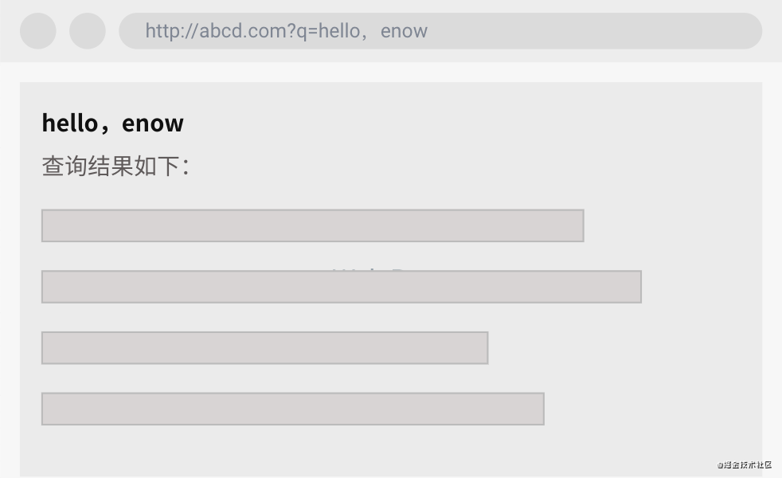
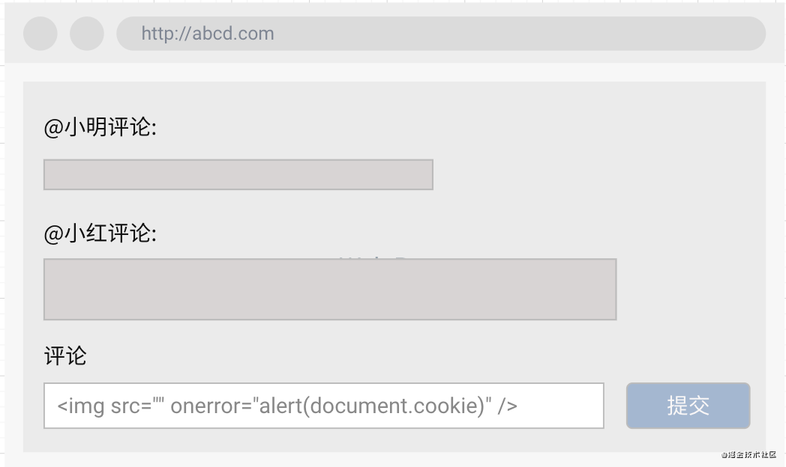
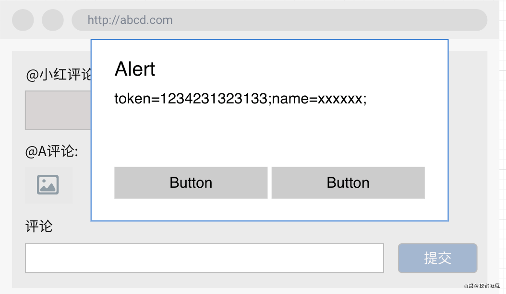
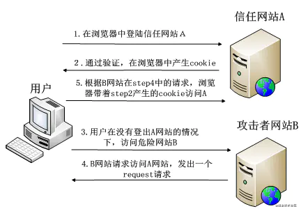
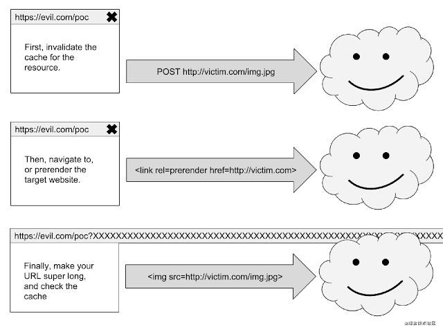

## 前言

Hello，AV8D～ 今天我们要分享的主题是前端`Web`安全。`web`安全的重要性不言而喻，是所有互联网企业都绕不开的话题。

在 Web 前端领域，尽管浏览器已经在系统层面帮我们做了诸多的隔离和保护措施，但是网页代码开放式的特点和`html、JS`的语言特性使得黑客们依然有非常多的可乘之机，`Google、facebook`等等都有各自的漏洞悬赏机制，力求在黑客之前发现和修复漏洞，将企业损失降到最低。

Web 安全是老生常谈的话题，但是常说常新，今天就再次梳（c）理（v）一遍前端的一些 Web 攻击手段，让大家看完这篇文章之后可以学到：

* 常见的前端安全问题以及对应的解决方案；
* 一丢丢网络攻击的小技巧和小知识；
* 一些经典的漏洞攻击案例；
* 以及最近进入我们视野的新的攻击手段；

## XSS

### 1、XSS 介绍

`XSS`的全称是 `Cross-Site Scripting`，跨站脚本攻击。是指通过利用网页开发时留下的漏洞，通过巧妙的方法注入恶意指令代码到网页，使用户加载并执行攻击者恶意制造的网页程序。通俗一点讲，就是黑客想法设防地让用户在访问的网页里运行自己写的攻击代码，一旦成功运行，黑客就有可能干出以下勾当：

* 获取当前用户在这个网站的`cookies`，从而拿到用户的敏感信息；
* 以当前用户的身份发起一些非用户本意的操作请求，比如删除网站好友，发帖，发私信等等；
* 实现`DDos`攻击；

根据攻击的来源，`XSS`可以大体分为持久型攻击和非持久型攻击（当然也有分反射型、存储型和 Dom 型的，我个人更愿意选择第一种分类，因为更便于理解）。

#### 非持久型攻击

非持久型 XSS 的特点在于即时性，它不需要存储在服务器中，通过巧妙地构造一个带恶意代码的 URL，然后引导用户点击访问，即可实现攻击。

举一个简单的小栗子，假设有个网站如下。


细心的你发现这个页面会把`url`上面的`q`参数内容放到网页中，而你打开调试台看到网页的代码实现如下：

```js copyable
<h1 id="query-key"></h1>
<span>查询结果如下</span>
// ...
<script>
  const reg = new RegExp("(^|&)q=([^&]*)(&|$)", "i");
  const res = window.location.search.substr(1).match(reg);
  if (res != null) {
      const query = decodeURIComponent(res[2]);
      document.getElementById('query-key').innerHTML = query;
  };
</script>
复制代码
```

发现它没有对`query`做过滤，而且直接用`innerHTML`方法插入到了`DOM`中，你看完差点笑出声：一点安全意识都没有！那假如你想针对这个网站设计一个`URL`来让用户点击后发起一个`XSS`攻击，从而拿到用户的`cookies`数据，你会怎么做呢？

那还不是非常的`so easy`，反手就可以写出一条`XSS`的链接出来：

```
http://abcd.com?q=<script>alert(document.cookie)</script>
复制代码
```

这样网页会把`q`参数中的 script 标签插入到 DOM 中执行，进而弹出提示框。

思路肯定是没问题的，不过你可能会发现不起效果，这是因为浏览器针对`script`等一些危险标签的插入做了拦截过滤，当然了这难不倒我们，毕竟咱们也不能把我要干坏事写在脸上，这不尊重对手，所以咱们换种委婉一点的写法就行了：

```
http://abcd.com?q=
复制代码
```

因为是插入一张图片，浏览器一般不会过滤拦截，然后我们把`src`置空使其触发`onerror`事件，间接地执行我们的恶意脚本。done！

### 持久型攻击

你可能发现非持久型攻击有个不好的地方，那就是在攻击之前你得先让用户能够看到你的这行 URL 并且诱导他点击，说白了你还得想办法提高这个恶意链接的曝光度！这好麻烦啊，那有没有一劳永逸的方法呢？

假如我们可以想办法把恶意代码放到网站的数据库里边存起来，那接下来这个网站所有访问到我这个恶意数据的用户不就都遭殃了吗？

因此假如某个网站的评论区也未作过滤的安全处理，那么我们就可以通过评论的方式将恶意脚本提交至后台服务器，之后任何访问了此评论页面的用户，都会执行到我的代码，从而达到攻击目的。

A 用户在评论里边写入了一条恶意代码并提交后台：


当 B 用户访问这个评论页面时，网页就会加载 A 的评论，进而触发恶意代码（而此时 B 用户其实啥都没做，他只是非常乖巧地打开了这个非常正规的网站，然后他就中招了）：


因此我们可以总结一下持久型 XXS 的特点：

* 因为被保存在了数据库中，因此它具有持久性；
* 由于不需要诱导用户点击恶意链接即可造成攻击，更易达到攻击目的，因此持久型 XSS 更具危害性；

### 2、防御方式

介绍完概念，我们可以知道要想抵御 XSS 攻击，大概可以从两方面入手：

* 想办法阻止恶意代码的注入和执行；
* 用更安全的方法校验和保护用户的身份凭证，以降低 XSS 攻击之后带来的危害；

1. 使用 HTML 转义。对外部插入的内容要永远保持警惕。
   对所有外部插入的代码都应该做一次转义，将`script`,`& < > " ' /`等危险字符做过滤和转义替换，同时尽量避免使用`innerHTML`,`document.write`,`outerHTML`,`eval`等方法，用安全性更高的`textContent`,`setAttribute`等方法做替代；
2. 开启 CSP 防护。内容安全策略（CSP）的设计就是为了防御 XSS 攻击的，通过在 HTTP 头部中设置`Content-Security-Policy`，就可以配置该策略，如果将 CSP 设置成一下模式：

```js copyable
Content-Security-Policy: script-src 'self'
复制代码
```

那么该网站将：

* 不允许内联脚本执行;
* 禁止加载外域代码;
* 禁止外域提交;

这将有效地防范 XSS 的攻击，当然他也非常严格，可能会对自身的业务开发也造成一定限制，更多关于 CSP 的内容可以查看[MDN](https://developer.mozilla.org/zh-CN/docs/Web/HTTP/CSP)。

3. 设置 HttpOnly。当然这已经是属于降低 XSS 危害的方法，对于所有包含敏感信息的 cookie，都应该在服务端对其设置`httpOnly`，被设置了`httpOnly`的 cookie 字段无法通过 JS 获取，也就降低了 XSS 攻击时用户凭据隐私泄漏的风险。

## CSRF

### 1、CSRF 介绍

又是一个耳熟能详，面试常问的知识点。

CSRF（Cross-site request forgery）中文名称跨站请求伪造，攻击者诱导受害者进入第三方网站，在第三方网站中，向被攻击网站发送跨站请求。利用受害者在被攻击网站已经获取的注册凭证，绕过后台的用户验证，达到冒充用户对被攻击的网站执行某项操作的目的。

简单介绍一下 CSRF 的攻击流程：

* 1、受害者登录目标网站 A；
* 2、受害者以某种方式接触到恶意网站 B 的链接；
* 3、受害者点击链接访问网站 B, 网站 B 中的 js 代码执行， 偷偷向目标网站 A 发送某个请求；
* 4、由于受害者登录过网站 A, 因此请求携带了网站 A 的相关 cookie 凭证，最后请求成功执行；

最后在受害者不知情的情况下，恶意网站向目标网站以受害者身份执行了一些带权限的操作，给受害者带来一系列危害和损失。



这个过程很好理解，篇幅有限，这里就不举例子做详细的解释了。

至于浏览器存在跨域限制，那么恶意网站如何对目标网站发起请求的问题，这属于如何解决跨域限制的知识点，在这里可以简单总结为以下方法：

* 对于 GET 请求非常容易了，`img`标签链接不受浏览器的跨域限制，因此可以直接以 img 的形式发起请求；
* 对于 POST 请求，通过 CORS 方法，还是很容易实现；

### 2、防御方式

知道了整个攻击的流程，那么我们就可以着手看看在哪些阶段可以对 CSRF 攻击做防御工作。

* 首先该攻击请求基本是从第三方网站中发起，因此客户端似乎无法通过代码来阻止请求的发起。
* 但是关键的一步在于恶意请求发起必须要带上身份凭据，请求才能被通过和执行，那如何通过一系列措施来加大三方网站对身份凭据的获取难度，以及完善服务端身份凭证的校验方式，成为了防御 CSRF 的重点工作。

1. SameSite Cookie

如果能让第三方发起的请求无法携带相关的 cookie，那一切问题好像就解决了啊。值得庆幸的是，浏览器针对 cookie 提供了`SameSite`的属性，该属性表示 Cookie 不随着跨域请求发送。该提案有 Google 提出，美中不足的是目前还在试行阶段，存在兼容性问题。

2. CSRF Token

既然浏览器暂时无法帮我们解决所有问题，那就自己想办法把身份校验机制搞复杂一点，只靠 cookie 没有安全保障，那就再加一个校验维度进来。SCRF Token 就是这样一种解决方案。

这个方案流程就是：在用户访问网站时，后台服务器根据算法再生成一个 Token，然后把这个 Token 放在 seesion 中，当网站发起请求时，不仅要携带 cookie 凭证，还要把这个 Token 也带上，后台一起校验之后确认身份再执行操作。由于 SCRF Token 是放在 session 中，因此当第三方网站发起请求时，无法拿到这个 SCRF Token，故身份校验不再通过，就达到了防御攻击的效果。

3. 同源检测

由于 CSRF 都是通过三方网站发起，因此我们如果能判断服务器每次收到的请求来自哪些网站，就可以过滤那些存在安全风险的网站发起的请求，降低被攻击的风险。

`Referer`和`Origin`是 http 请求的头部字段之一，用来标志该请求是从哪个页面链接过来的。因此后台服务器可以通过检查该字段是否是来自自己的网站链接，来避免第三方网站发起 CSRF 攻击。但是同源检测的可靠性并不高，比如在 302 重定向的时候，为了保护来源，http 请求不会携带`Origin`字段，而`Referer`字段会受到 Referer Policy 规则的限制而不发送。

4. 增加二次验证

针对一些有危险性的请求操作（比如删除账号，提现转账）我们可以增加用户的二次，比如发起手机或者邮箱验证码检验，进而降低 CSRF 打来的危害。

### 3、一些案例

1. Google Digital Garage 是 Google 的一个在线教育产品，一名国外的安全工程师在他的[博客](https://santuysec.com/2020/01/21/google-bug-bounty-csrf-in-learndigital-withgoogle-com/?__cf_chl_captcha_tk__=268ab19e1d4dc20ceb9212abf162cb47dde2239c-1604970822-0-Aa2-q-r691b_8BlRIlE5i7-Z65g2PoNGNVGvZZPTxdY7e3xb1bZMhNdEbWylKGlrmU0THQ5lyyV1ZyA1KeeGrFV3t6jWx_hz4lzTBOHT2Sr1E1GBaNDGMsHrfmZ_ySQI7smsbOrER3AAEdOprAYFom6064hCSsYTQT5p6Xx5wq0186SQUwHvi4IgRGGajKdEtDJjkbyoxecsOhe59hm0Dcy2RMTtk7bEvMB0fQLrxiCaaDuBavevcmPd4darMO5Pk1i_CpRZT7QOVc7bdVacZVJNz8iDJBYG8b56cWtp6WPy2Tgi2-aMq1DEAkD5Q0fuDV0g01hyliGO_79pdS6TC98mtYUC-D8r3p_0nc11ELInyqY3TGZYDcV8I_DvyvF5CpX4jtNBPbKDI4gYdoixQVabyt9_S-dOCY6pTL-VPcj6pnmHTxCMKLqHZIKZZru9vJNBZaCUTI67HpNuMj1s9ID7i0D7tTzXSwI5A0wDbRA8fBV-kDaGIJkRl0WWoNMGCoFtAbXXtZo2LcADOTWjR7-2FTxA20c3ee8IzTURcDgXpr3iwtzZqfbGu-5Sf6TXLw0rbuiE2ACAVCSKTEKCr-k)介绍了如何通过 CSRF 攻击删除该网站的个人账号。
2. [这篇文章](https://ysamm.com/?p=185)则介绍了 Facebook 网站上的安全漏洞，如何通过 CSRF 绕过安全保护实现帐户接管。

## XS-Leaks

相信有些小伙伴已经开始犯困，毕竟前面介绍的两种 Web 攻击手段对很多人来说已经耳熟能详，如数家珍了。那本文的最后一章再介绍一种可能不太常见，但是却开始重新回归大众视野的 Web 攻击手段：XS-Leaks。

### 1、什么是 XS-Leaks？

XS-Leaks 即跨站泄漏。 XS-Leaks 利用了对 HTTP 缓存进行查询的机制，通过对资源缓存的判断进而推断出当前用户的相关信息。如果你第一次听说 XS-Leaks，那我相信你一定很意外为什么普普通通的 HTTP 资源缓存也能造成用户信息泄漏。

Chrome 浏览器团队在他们的开发者网站中发表了[一篇文章](https://developers.google.com/web/updates/2020/10/http-cache-partitioning)，表示在 86 版本之后的浏览器将开始对请求缓存资源机制进行分区（分域名）管理，原因就是因为之前的缓存机制可能会造成隐私泄漏。

在这之前 Chrome 浏览器的请求缓存策略很简单：

* 1、用户访问 A 页面，请求一张图片资源，浏览器拿到这张图片之后，会将这张图片进行缓存，并把这张图片的 URL 作为缓存查询的键值；
* 2、用户接着访问 B 页面，假如这个页面也用到了上述的那张图片，此时浏览器会先查询是否已经缓存了此资源，由于缓存过这张图片，因此浏览器直接使用了缓存资源；

由于缓存资源没有域名限制，所有网站都共享了缓存资源，因此利用这一点就可以检测用户是否访问过特定的网站：恶意网站通过发起特定的资源请求，通过判断此次资源是否来自缓存就可以推断出用户的浏览历史。比如我在我的网站中请求掘金的 LOGO 图片（或者其他更具唯一性的资源），如果我判断出这张图片来自缓存，那我就可以知道该用户访问过掘金网站。

XS-Leaks 和上述的原理类似，利用了对 HTTP 缓存进行查询的机制，通过检测一个查询询问是否有结果来获取一些用户数据。XS-Leaks 攻击的主要步骤流程如下：

* 1、删除特定网站的缓存资源。
* 2、强制浏览器刷新网站。
* 3、检查浏览器是否缓存了在（1）中删除的资源。


举一个小栗子，假如我们想知道当前访问我们网站的用户是否是某社交网站（假设链接为 http://xxx.com）昵称为`@helloWorld`的用户，利用 XS-Leaks 攻击应该怎么做呢？

首先我们可以先将这名`@helloWorld`的用户头像图片从社交网站上扒下来，假设该图片链接长这样： `http://xxx.com/user/helloWorld.jpg`。

为了避免用户因为浏览了社交网站的一些页面（比如帖子列表页），请求过 helloWorld 的头像导致的缓存影响判断目的，当用户访问我们的页面时，我们需要先想办法清空这张头像的浏览器缓存。那么怎么能强制清楚一张图片的缓存呢？

```js copyable
FETCH POST http://xxx.com/user/helloWorld.jpg
复制代码
```

没错，通过发起一个 POST 请求，就可以清除浏览器对这张图片的缓存（感兴趣的小伙伴可以看看[这篇文章](https://www.mnot.net/blog/2006/02/18/invalidation)）。

接下来通过`iframe`或者`<link ref=rerender href="http://xxx.com/user" />`等方式悄悄发起一个请求，访问社交网站的个人信息页面`http://xxx.com/user`（这个页面包含用户的头像图片）。

紧接着只需要再请求一次头像`http://xxx.com/user/helloWorld.jpg`，判断其是否来自缓存，如果是，那不就说明了刚才请求的个人信息页面包含了这张图片，就可以推断出该名用户就是`@helloWorld`了。

那么问题又来了：如何判断一个请求来自缓存呢？

方法还是很多的，一种方法是通过读取 img 的宽高属性，来判断图片是否来自缓存：

```JS copyable
const img = new Image();
img.onload = () => {
  // 如果img不是来自缓存，那么只有在图片加载完成触发onload之后，才能拿到实际的witdh值
  console.log(img.width);
}
img.src = 'http://xxx.com/user/helloWorld.jpg';
// 如果存在缓存，在这里可以立即读取到图片的 witdh 值，否则会打印 0
console.log(img.width);
复制代码
```

至此一次 XS-Leaks 攻击就完成了。我们也可以请求一些带权限的链接来判断用户是否拥有某个网站的特权身份等等。虽然这个小栗子看起来危害不大，只是做到了当前用户和目标网站账号的关联，但是不要小看黑客们的脑洞，一个看起来不起眼的漏洞很可能会带来巨大损失。

这里给大家分享一个关于 XS-Leaks 的[github 地址](https://github.com/xsleaks/xsleaks)，里边记录了与 XS-Leaks 相关的攻击方式、知识和实际案例，帮助大家更深刻地理解概念和攻击手段。

### 2、防御方式

介绍了那么多，是时候总结一下 XS-Leaks 的一些防范措施了。可以看到 XS-Leaks 也是从第三方网站中发起攻击的，而且都是通过向目标网站发起请求而达到攻击目的，是不是和 CSRF 的攻击方式很相似？

没错，CSRF 的防御手段同样可以让 XS-Leaks 对带鉴权的请求访问无效，从而降低危险。当然有些时候这种攻击其实并不需要鉴权就能达成目的，因此 CSRF 的防御手段并不能做到完美抵御，所以在浏览器层面增加缓存分区就显得非常有必要了：

* 设置 SameSite Cookie；
* CSRF Token;
* 浏览器支持缓存分区；

### 3、Web 服务端缓存攻击

XS-Leaks 利用了浏览器缓存的漏洞实现了攻击，但是其实不仅仅浏览器可以缓存，Web 服务器也是可以有缓存的，服务器缓存是把请求过的资源暂且放在一个专门的缓存服务器（例如 CDN）上，当下一个用户访问同样的资源时就可以直接从缓存服务器上拿到响应，从而减轻 Web 服务器的压力。

那假如我们可以把攻击代码通过某种方式放在 CDN 等缓存服务器中，那发起了相同资源请求的用户就都会拿到这份恶意代码从而遭受攻击，这不就实现了 XS-Leaks 的“存储型攻击”？

缓存服务器通过`cache-key`来确定两个用户访问的是否是同一个资源，而这个`cache-key`通常由请求方法、路径、query、host 头组成。假如一个 Web 服务器有如下请求响应：


该响应中将请求头`X-Forwarded-Host`的值直接拼接到 meta 标签的 content 属性中，由此产生了 XSS 攻击的漏洞，因此我们通过发起一个如下请求：

```js copyable
GET /en?dontpoisoneveryone=1 HTTP/1.1
Host: www.redhat.com
X-Forwarded-Host: a."><script>alert(1)</script>
复制代码
```

服务器就会返回如下响应，并缓存到缓存服务器中：

```js copyable
HTTP/1.1 200 OK
Cache-Control: public, no-cache
…
<meta property="og:image" content="https://a."><script>alert(1)</script>"/>
复制代码
```

由于`X-Forwarded-Host`不属于`cache-key`的一部分，因此当其他用户发起`/en`请求时，服务器都会认为是请求同一个资源从而应用缓存策略，将上面的恶意响应直接响应给用户，造成攻击。

上述的例子来自于[BlackHat2020 议题之 Web 缓存投毒](https://www.anquanke.com/post/id/213597#h2-0)这篇文章，文章非常详细地介绍了 Web 服务器缓存攻击的原理和案例，有兴趣的小伙伴也可以看看。

## 再说点啥

尽管已经有这么多的措施来应对和抵御 Web 的各种攻击，但依旧有一个又一个的安全漏洞被黑客们发现和攻破，强如 Google，页面简洁如 Google Search 的网站，依然在 2019 年遭到了 XSS 攻击。而这次攻击却只需要一行代码：

```js copyable
<noscript><p title="</noscript>">
复制代码
```

大致的原因是 Google 在转义插入文本时，使用了 HTML 提供的`template`标签，使用`template`是个很不错的选择，因为它可以用来解析 HTML，并且在解析过程中不会触发 JavaScript 脚本执行。然而`template`是 JavaScript Disabled 环境，而 noscript 在允许 JavaScript 和禁止 JavaScript 环境下的解析是不同的，这导致了这段恶意代码经过解析和 sanitize 之后仍然存在风险，最后成功实现了 XSS 攻击。有兴趣的小伙伴可以看看这篇[关于这次 XSS 攻击的文章](https://www.anquanke.com/post/id/213422)。

类似的“旁门左道”的攻击方式其实还很多，比如我们经常会用到的`SVG`图片，SVG 的结构和 HTML 结构非常相似，通过`forginObject`标签我们还可以把`script`或者其他 HTML 标签插入到 SVG 图片中，假如 Web 服务器允许用户上传任意 SVG 图像，那么就会存在持久型 XSS 攻击的安全风险。HTML 转义有时候也并非一两行代码就能搞定，当我们碰到类似文本编辑需要保留用户粘贴内容样式的时候，如何在保留这些 HTML 的同时规避 XSS 的风险就值得我们仔细斟酌设计。

众所周知，我们在开发网页的时候基本不会遇到 HTML 的语法报错问题，因为 HTML 的解析引擎有着非常强大的容错机制，以至于不管你怎么写，浏览器都能帮你把文档解析渲染出来。然而这种容错性和复杂的解析逻辑也使得 XSS 能够不断找到新的攻击方式。

事实上，当我在用某网站在线制作前面章节的两张交互图的时候，就“无意中”触发了我里边的`img`代码，直接弹出了对话框，这也从侧面说明了 Web 安全其实在很多开发团队中并没有得到足够多的重视，然而诸多的攻击案例告诉我们，我们的网站一旦遭受了攻击其损失可能是不可估量的，因此我们对于 Web 安全，我们不能只是嘴上说说，纸上谈兵，或者只是当做面试的一个八股文知识点，而是应该时刻保持警惕，警钟长鸣才行。
