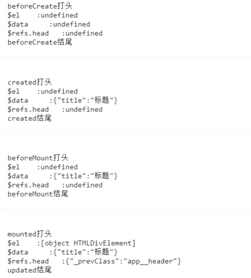

# 1.什么是生命周期？

每个Vue实例在被创建时都要经过一系列的初始化过程：

开始创建 -> 初始化数据 -> 编译模板 -> 挂载DOM-渲染 -> 更新-渲染 -> 销毁等一系列过程

通俗而言：Vue实例从创建到销毁的过程

生命周期分为8个过程：创建前，创建后，挂载前，挂载后，更新前，更新后，销毁前，销毁后。

# 2.vue生命周期的作用是什么？

在Vue实例经过一系列初始化的过程中也会运行一些 叫做 生命周期钩子 的函数， 生命週期裡邊这些事件钩子，给予了用户在不同阶段可以添加自己代码的机会。


# 3.各个生命周期中打印下el，data，dom节点

```

export default {
  name: 'App',
  data() {
    return {
      title: '标题'
    }
  },
   methods: {
    onDestoryClick() {
      this.$destroy()
    }
  },
  beforeCreate() {
    console.log(
      `\n\nbeforeCreate打头\n$el    :${this.$el}\n$data     :${JSON.stringify(
        this.$data
      )}\n$refs.head   :${JSON.stringify(
        this.$refs.head
      )}\nbeforeCreate结尾\n\n`
    )
    console.log(this.$vnode)
  },
  created() {
    console.log(
      `\n\ncreated打头\n$el    :${this.$el}\n$data     :${JSON.stringify(
        this.$data
      )}\n$refs.head   :${JSON.stringify(this.$refs.head)}\ncreated结尾\n\n`
    )
    console.log(this.$vnode)
  },
  beforeMount() {
    console.log(
      `\n\nbeforeMount打头\n$el    :${this.$el}\n$data     :${JSON.stringify(
        this.$data
      )}\n$refs.head   :${JSON.stringify(this.$refs.head)}\nbeforeMount结尾\n\n`
    )
    console.log(this.$vnode)
  },
  mounted() {
    console.log(
      `\n\nmounted打头\n$el    :${this.$el}\n$data     :${JSON.stringify(
        this.$data
      )}\n$refs.head   :${JSON.stringify(this.$refs.head)}\nmounted结尾\n\n`
    )
    console.log(this.$vnode)
  }
}

```



### 1.beforeCreate

拿不到任何数据，它在实例初始化之后，数据观测 (data observer) 和 event/watcher 事件配置之前被调用。

### 2.created

已经可以拿到data中的数据了，但是dom还没有挂载。会判断有无el，如果没有el则停止后面的模板挂载。

在实例创建完成后被立即调用。在这一步，实例已完成以下的配置：数据观测 (data observer)，属性和方法的运算，watch/event 事件回调。
使用场景：AJAX请求和页面初始化

### 3.beforeMount

和 created拿到的数据相同 在挂载开始之前被调用：相关的 render 函数首次被调用。

### 4.mounted

el被创建dom已经更新，vue实例对象中有template参数选项，则将其作为模板编译成render函数，编译优先级render函数选项 > template选项

使用场景：常用于获取VNode信息和操作，AJAX请求
注意 mounted 不会承诺所有的子组件也都一起被挂载。如果你希望等到整个视图都渲染完毕，可以用 vm.$nextTick 替换掉 mounted

### 5.beforeUpdate和updated

使用的比较少，一般用计算属性和watch代替所以在此不在说明

### 6.destroyed

Vue 实例销毁后调用。调用后，Vue 实例指示的所有东西都会解绑定，所有的事件监听器会被移除，所有的子实例也会被销毁。
{: id="20201221161518-8p0fm1g" type="doc"}
