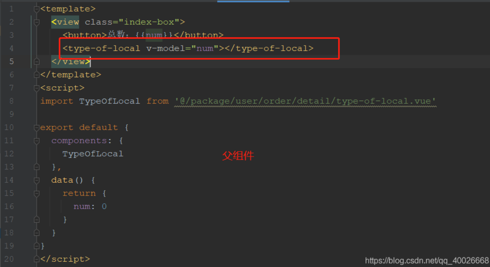
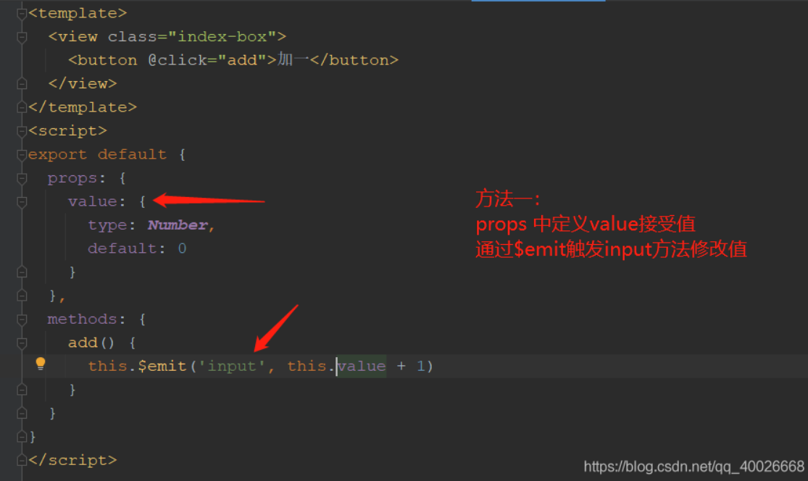
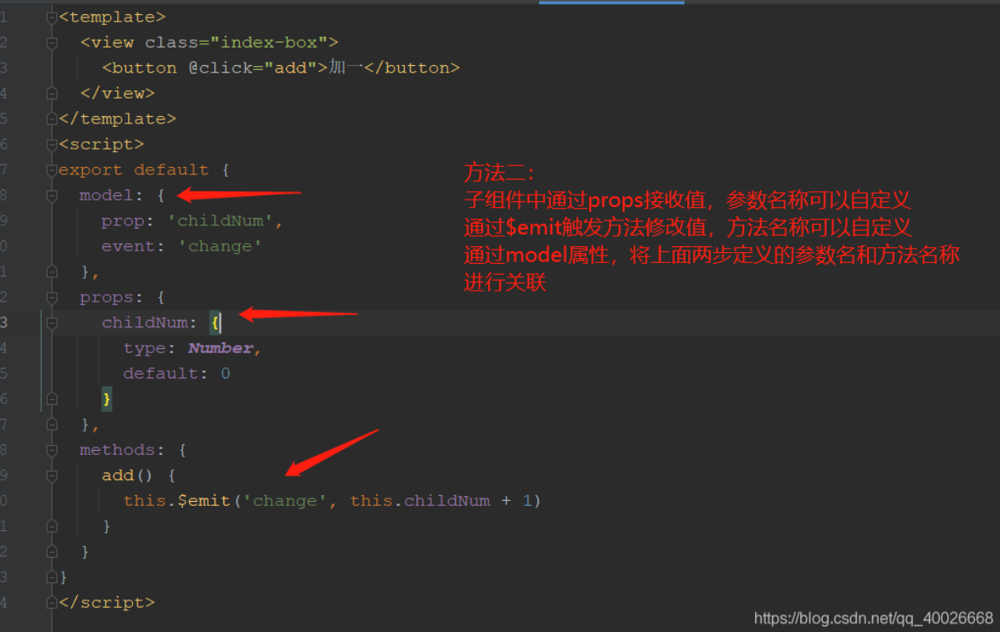
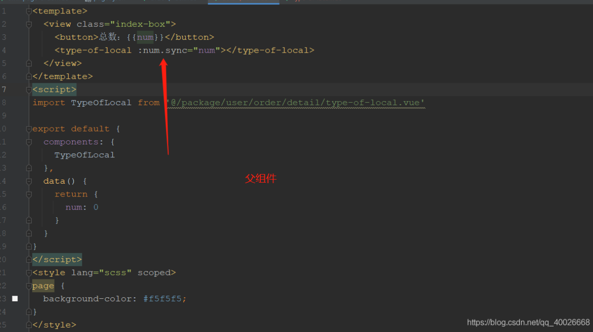
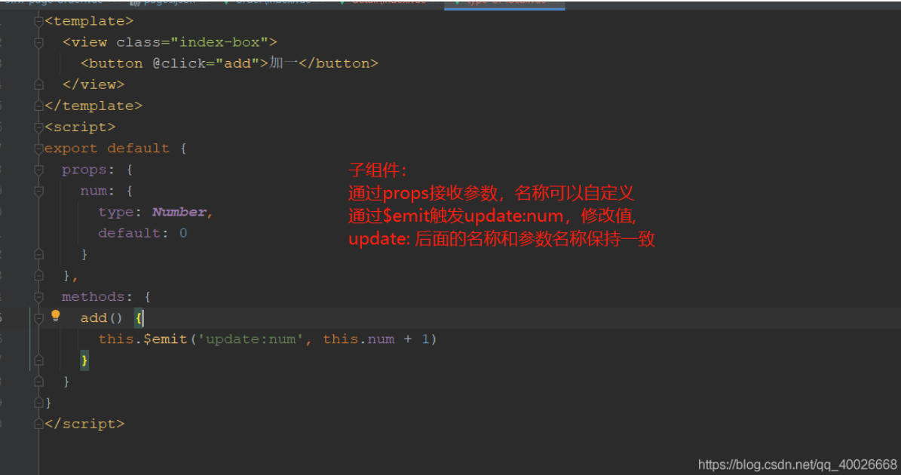

1. 父组件使用v-model绑定，子组件props接收参数，$emit触发input事件传值

   

   

2. 父组件使用v-model绑定，子组件props接收参数，参数名称可以自定义，$emit触发方法传值，方法名称可以 自定义，通过model属性将prop参数名和事件名进行关联
   

3. 父组件使用:name.sync绑定，子组件props接收参数名称为name，$emit触发update:name事件传值，这三部的name名称可以自定义，但需保持一致
   
