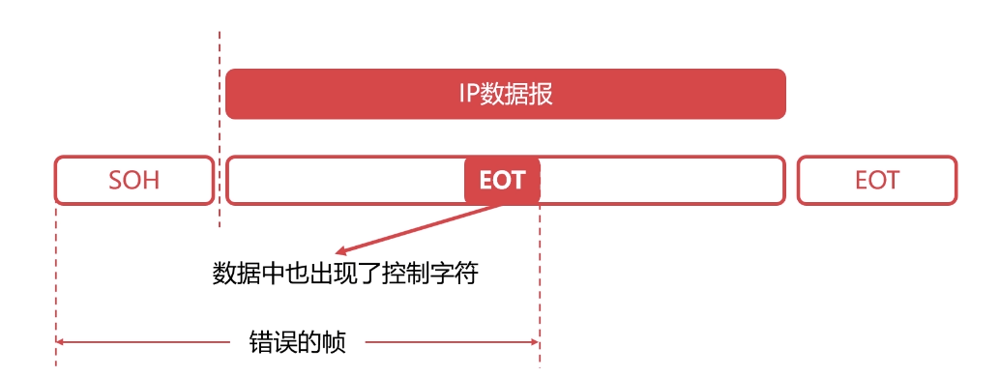

# 1.封装成帧

物理层位于((20201013225932-xzp1fmo "TCP/IP"))最后一层，OSI 倒数第二层。

`帧`是数据链路层的基本单位，发送端在网络层的一段数据前后添加特定标记形成帧，接收端根据前后特定标识识别出帧

> 帧首部和尾部是特定的控制字符（特定比特流）
>
> SOH：00000001
>
> EOT：00000100

# 2.透明传输

解决办法，就是在控制字符前面添加 ESC 转义字符，如果数据中也出现了转义字符，在转义字符前再增加转义字符

# 3.差错检测

物理层只管传输比特流，无法控制是否出错，数据链路层负责器差错检测的工作

{: id="20201014210803-qtdzza2" type="doc"}
