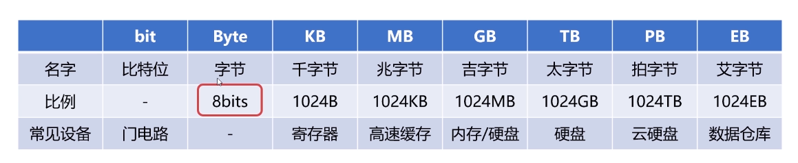

# 1.容量单位
{: id="20201014190108-p7w5r55"}

### 1.1物理层面，高低电平记录信息，理论上只认0和1两种状态。**0/1称为bit（比特位）**1.2字节：**1Byte=8Bits**
{: id="20201014190108-ycgutvf"}

# 2.速度单位
{: id="20201014190108-3d7g5o9"}

### 2.1网络速度单位
{: id="20201014190108-ycxj97s"}

> 例如100M=100M/s
> {: id="20201014190108-cpivxj1"}
{: id="20201014190108-f10xzln"}

为什么电信拉的100M光纤，测试峰值速度只有约12M/s？
网络常用单位为**Mbps**
{: id="20201014190108-mlr08t5"}

> 100M/s=100Mbps=100Mbit/s
> 100Mbits/s=(100/8)MB/s=12.5MB/s
> {: id="20201014190108-0zheo1l"}
{: id="20201014190108-jkki7tj"}

### 2.2cpu速度
{: id="20201014190144-u48t60o"}

CPU的熟读一般体现为CPU时钟频率，CPU的时钟频率的单位一般是**赫兹（Hz）**
{: id="20201014190108-9mysq4l"}

> 赫兹就是秒分之一，它是每秒中的周期性变动的重复次数的计量
> 在CPU中就是高低点位在每秒钟变换的次数
> 2GHz=2*1000^3Hz=每秒20亿次
> {: id="20201014190108-h14loc6"}
{: id="20201014190108-tz0midb"}
