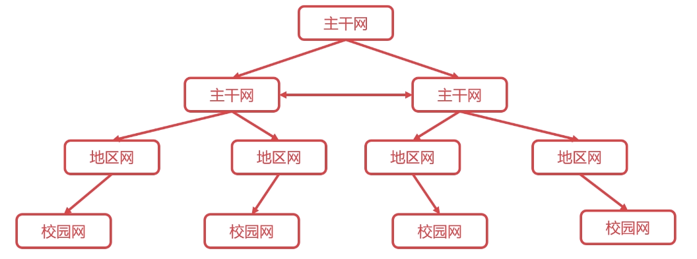

# 1.互联网的发展历史
{: id="20201013173425-3df0qja"}

{: id="20201013174603-upp0q32"}

1) 第一阶段:单个网网
{: id="20201013173954-vose35p"}

{: id="20201013180311-se0xysf"}

2. 第二阶段:三层结构互联网
{: id="20201013180450-ukntxt8"}

{: id="20201013180426-4nja8w2"}

3. 多层次ISP互联网
{: id="20201013180403-c51i6ep"}

{: id="20201013181620-96e2gjc"}
