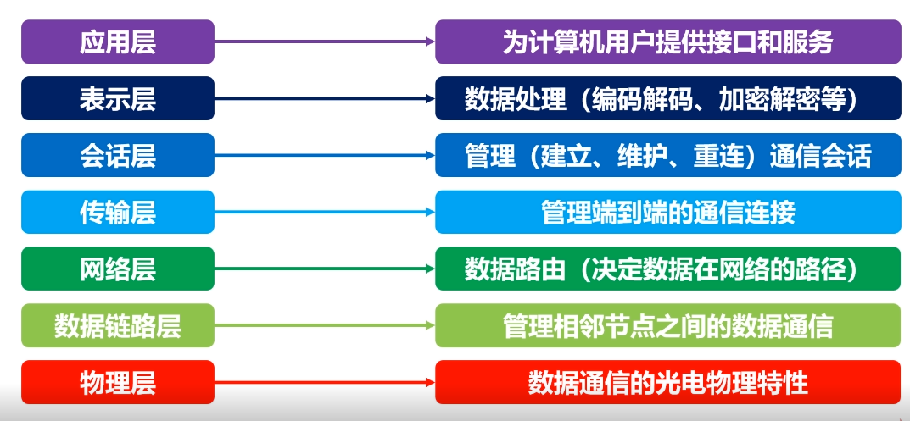

# 1.层次结构基本原则
{: id="20201013191630-y2kmxbt"}

### 为什么要互联网要使用层次结构设计？
{: id="20201013192303-mmoatsj"}

1. 保证数据通路顺畅
2. 识别目的计算机
3. 目的计算机的状态
4. 数据是否错误
{: id="20201013191702-dguuaxk"}

`分层实现不同的功能`
{: id="20201013191920-3cdhd2w"}

### 基本原则
{: id="20201013192351-ewxk2q7"}

1. 各层之间是相互独立的
2. 每一层要有足够的灵活性
3. 各层之间完全解耦
{: id="20201013192457-83d05yb"}

# 2.OSI七层模型
{: id="20201013191639-d4pzf00"}

{: id="20201013230615-agltmsh"}

> OSI想成为全球计算机都遵循的标准
> {: id="20201013230805-u4lr99r"}
>
> OIS在市场化的过程中困难重重，TCP/IP在全球范围成功运行
> {: id="20201013230840-j2j3r3o"}
{: id="20201013230803-cfhcjvq"}

# 3.TCP/IP
{: id="20201013225932-xzp1fmo"}

{: id="20201013231011-a709v5m"}
