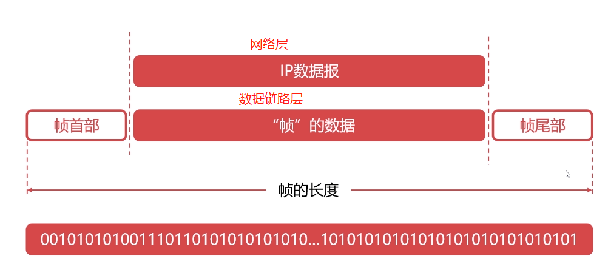
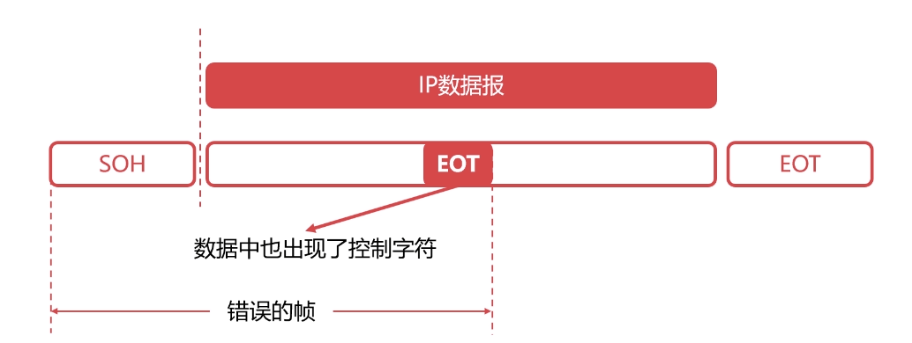
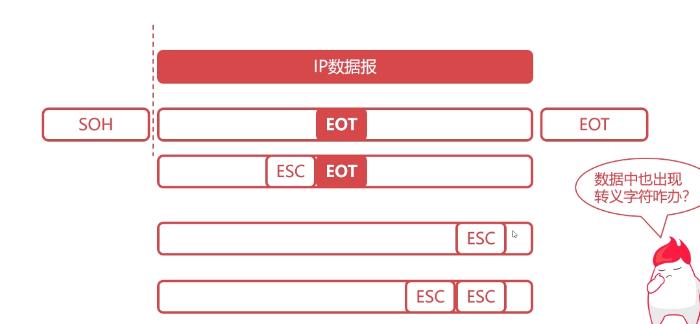

# 1.封装成帧
{: id="20201014210920-lnrfzbw"}

物理层位于((20201013225932-xzp1fmo "TCP/IP"))最后一层,OSI倒数第二层。
{: id="20201014210821-tgjiujc"}

`帧`是数据链路层的基本单位，发送端在网络层的一段数据前后添加特定标记形成帧，接收端根据前后特定标识识别出帧
{: id="20201014211005-2o10y39"}

{: id="20201014210909-r945u1j"}

> 帧首部和尾部是特定的控制字符（特定比特流）
> {: id="20201014211809-5a6ajlg"}
>
> SOH：00000001
> {: id="20201014211841-kj79hx7"}
>
> EOT：00000100
> {: id="20201014211853-o7yqc3u"}
{: id="20201014211746-oxrrcqq"}

# 2.透明传输
{: id="20201014211925-ywkrchd"}

{: id="20201014211932-ynv0evk"}

解决办法，就是在控制字符前面添加ESC转义字符，如果数据中也出现了转义字符，在转义字符前再增加转义字符
{: id="20201014212321-mruqgbt"}

{: id="20201014212219-z5qyshw"}

# 3.差错检测
{: id="20201014212458-vbs0ob9"}

物理层只管传输比特流，无法控制是否
{: id="20201014212508-y5jlu9f"}

{: id="20201014212317-w0x1wal"}
