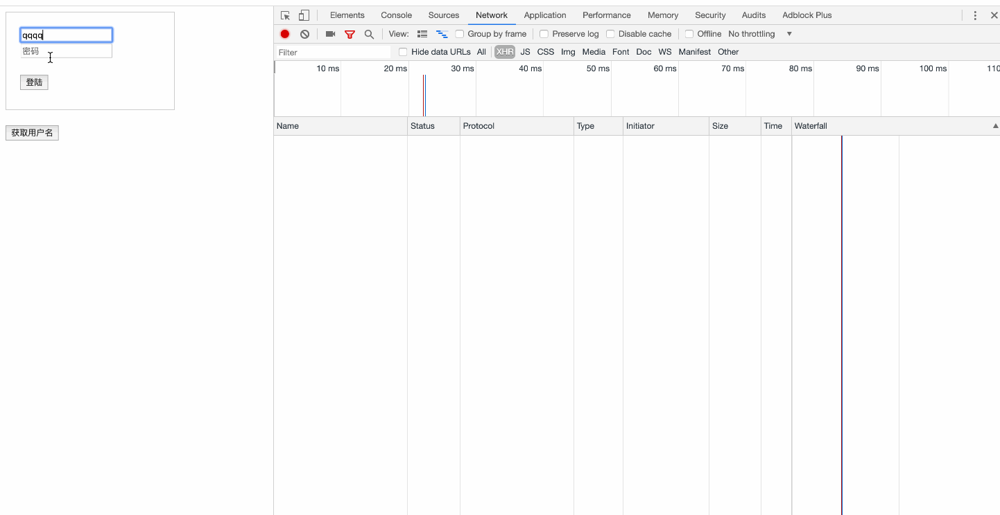

# 前言
{: id="20201126094228-e9zrjsh"}

## 无状态的HTTP协议
{: id="20201126094228-qfc13wr"}

很久很久之前， Web基本都是文档的浏览而已。既然是浏览， 作为服务器， 不需要记录在某一段时间里都浏览了什么文档， 每次请求都是一个新的HTTP协议，就是请求加响应。不用记录谁刚刚发了HTTP请求， 每次请求都是全新的。
{: id="20201126094228-6rlje7r"}

## 如何管理会话
{: id="20201126094228-klcemd9"}

随着交互式Web应用的兴起， 像在线购物网站，需要登录的网站等，马上面临一个问题，就是要管理回话，记住那些人登录过系统，哪些人往自己的购物车中放商品，也就是说我必须把每个人区分开。
{: id="20201126094228-mv6s8vy"}

本文主要讲解cookie，session, token 这三种是如何管理会话的；
{: id="20201126094228-g21pgen"}

# cookie
{: id="20201126094228-9mn503t"}

cookie 是一个非常具体的东西，指的就是浏览器里面能永久存储的一种数据。跟服务器没啥关系，仅仅是浏览器实现的一种数据存储功能。
{: id="20201126094228-ut59gnw"}

cookie由服务器生成，发送给浏览器，浏览器把cookie以KV形式存储到某个目录下的文本文件中，下一次请求同一网站时会把该cookie发送给服务器。由于cookie是存在客户端上的，所以浏览器加入了一些限制确保cookie不会被恶意使用，同时不会占据太多磁盘空间。所以每个域的cookie数量是有限制的。
{: id="20201126094228-aaau49w"}

## 如何设置
{: id="20201126094228-vxxvk88"}

### 客户端设置
{: id="20201126094228-yv5zaez"}

```javascript
document.cookie = "name=xiaoming; age=12 "
```
{: id="20201126094228-4cmzj4u"}

* {: id="20201126094228-bjsrcvl"}客户端可以设置cookie的一下选项： expires, domain, path, secure(只有在https协议的网页中， 客户端设置secure类型cookie才能生效), 但无法设置httpOnly选项
{: id="20201126094228-tzbjo3v"}

> 设置cookie => cookie被自动添加到request header中 => 服务端接收到cookie
> {: id="20201126094228-sq5bioe"}
{: id="20201126094228-9pz9c3y"}

### 服务端设置
{: id="20201126094228-mx3bm9k"}

不管你是请求一个资源文件(如html/js/css/图片), 还是发送一个AJAX请求， 服务端都会返回response.而response header中有一项叫`set-cookie`, 是服务端专门用来设置cookie的;
{: id="20201126094228-2rlq7r8"}

* {: id="20201126094228-3m1btde"}一个set-cookie只能设置一个cookie, 当你想设置多个， 需要添加同样多的`set-cookie`
* {: id="20201126094228-x4770fq"}服务端可以设置cookie的所有选项： expires, domain, path, secure, HttpOnly
{: id="20201126094228-bwkpn4k"}

### Cookie，SessionStorage，LocalStorage
{: id="20201126094228-xigrfp1"}

HTML5提供了两种本地存储的方式 sessionStorage 和 localStorage；
{: id="20201126094228-ercqtn1"}


{: id="20201126094228-kkzaq6k"}

# session
{: id="20201126094228-oj4bfwv"}

## 什么是session
{: id="20201126094228-5ilv4wx"}

session从字面上讲，就是会话。这个就类似你和一个人交谈，你怎么知道当时和你交谈的是张三而不是李四呢？对方肯定有某种特征（长相等）表明他是张三；
session也是类似的道理，服务器要知道当前请求发给自己的是谁。为了做这种区分，服务器就是要给每个客户端分配不同的"身份标识"，然后客户端每次向服务器发请求的时候，都带上这个”身份标识“，服务器就知道这个请求来自与谁了。
至于客户端怎么保存这个”身份标识“，可以有很多方式，对于浏览器客户端，大家都采用cookie的方式。
{: id="20201126094228-xfbindi"}

## 过程(服务端session + 客户端 sessionId)
{: id="20201126094228-klez3iy"}


{: id="20201126094228-kgazy9e"}

* {: id="20201126094228-fanoby8"}1.用户向服务器发送用户名和密码
* {: id="20201126094228-wffcza5"}2.服务器验证通过后，在当前对话(session)里面保存相关数据，比如用户角色， 登陆时间等;
* {: id="20201126094228-lsy501w"}3.服务器向用户返回一个`session_id`, 写入用户的`cookie`
* {: id="20201126094228-1pq25cj"}4.用户随后的每一次请求， 都会通过`cookie`, 将`session_id`传回服务器
* {: id="20201126094228-874isbl"}5.服务端收到`session_id`, 找到前期保存的数据， 由此得知用户的身份
{: id="20201126094228-4ju2xkz"}

## 存在的问题
{: id="20201126094228-qa4ro9l"}

### 扩展性不好
{: id="20201126094228-67sdhh2"}

单机当然没问题， 如果是服务器集群， 或者是跨域的服务导向架构， 这就要求session数据共享，每台服务器都能够读取session。
{: id="20201126094228-xuhy3r1"}

举例来说， A网站和B网站是同一家公司的关联服务。现在要求，用户只要在其中一个网站登录，再访问另一个网站就会自动登录，请问怎么实现？这个问题就是如何实现单点登录的问题
{: id="20201126094228-elkkhhe"}

1. {: id="20201126094228-lb95phh"}Nginx ip_hash 策略，服务端使用 Nginx 代理，每个请求按访问 IP 的 hash 分配，这样来自同一 IP 固定访问一个后台服务器，避免了在服务器 A 创建 Session，第二次分发到服务器 B 的现象。
2. {: id="20201126094228-wr40vkr"}Session复制：任何一个服务器上的 Session 发生改变（增删改），该节点会把这个 Session 的所有内容序列化，然后广播给所有其它节点。
3. {: id="20201126094228-kvxr2w5"}共享Session：将Session Id 集中存储到一个地方，所有的机器都来访问这个地方的数据。这种方案的优点是架构清晰，缺点是工程量比较大。另外，持久层万一挂了，就会单点失败；
{: id="20201126094228-hedy6p8"}

另一种方案是服务器索性不保存session数据了，所有数据就保存在客户端，每次请求都发回服务器。这种方案就是接下来要介绍的基于Token的验证;
{: id="20201126094228-ealiv3v"}

# Token
{: id="20201126094228-i061sr2"}

## 过程
{: id="20201126094228-t5sh0wv"}


{: id="20201126094228-s019vq6"}

1. {: id="20201126094228-1wka28z"}用户通过用户名和密码发送请求
2. {: id="20201126094228-cu6pxaa"}程序验证
3. {: id="20201126094228-g1ay8yb"}程序返回一个签名的token给客户端
4. {: id="20201126094228-ofhd3rk"}客户端储存token, 并且每次用每次发送请求
5. {: id="20201126094228-1ssilgi"}服务端验证Token并返回数据
{: id="20201126094228-i28k4q7"}

这个方式的技术其实很早就已经有很多实现了，而且还有现成的标准可用，这个标准就是JWT;
{: id="20201126094228-4anysbz"}

## JWT(JSON Web Token)
{: id="20201126094228-n8x4v4a"}

### 数据结构
{: id="20201126094228-1ocknje"}

实际的JWT大概就像下面这样：
{: id="20201126094228-4egw33n"}


{: id="20201126094228-xmzmbik"}

JSON Web Tokens由dot（.）分隔的三个部分组成，它们是：
{: id="20201126094228-udd4ylm"}

* {: id="20201126094228-9ss44to"}Header（头部）
* {: id="20201126094228-5prppw7"}Payload（负载）
* {: id="20201126094228-h30qxjb"}Signature（签名）
{: id="20201126094228-9qmogqe"}

因此，JWT通常如下展示：
{: id="20201126094228-2x1ma5j"}

**xxxxx.yyyyy.zzzz**
{: id="20201126094228-ucynsv9"}

#### Header（头部）
{: id="20201126094228-urthoqi"}

Header 是一个 JSON 对象
{: id="20201126094228-dlh3if1"}

```javascript
{
  "alg": "HS256", // 表示签名的算法，默认是 HMAC SHA256（写成 HS256）
  "typ": "JWT"  // 表示Token的类型，JWT 令牌统一写为JWT
}
复制代码
```
{: id="20201126094228-p9j9ncw"}

#### Payload（负载）
{: id="20201126094228-3kt0zpn"}

Payload 部分也是一个 JSON 对象，用来存放实际需要传递的数据
{: id="20201126094228-qkx5mt3"}

```javascript
{
  // 7个官方字段
  "iss": "a.com", // issuer：签发人
  "exp": "1d", // expiration time： 过期时间
  "sub": "test", // subject: 主题
  "aud": "xxx", // audience： 受众
  "nbf": "xxx", // Not Before：生效时间
  "iat": "xxx", // Issued At： 签发时间
  "jti": "1111", // JWT ID：编号
  // 可以定义私有字段
  "name": "John Doe",
  "admin": true
}
复制代码
```
{: id="20201126094228-j5se4fk"}

JWT 默认是不加密的，任何人都可以读到，所以不要把秘密信息放在这个部分。
{: id="20201126094228-u0awrag"}

#### Signature（签名）
{: id="20201126094228-5f7qxjn"}

Signature 是对前两部分的签名，防止数据被篡改。
{: id="20201126094228-3yov8wi"}

首先，需要指定一个密钥(secret)。这个密钥只有服务器才知道，不能泄露给用户。然后，使用Header里面指定的签名算法（默认是 HMAC SHA256），按照下面的公式产生签名。
{: id="20201126094228-7v1o2we"}

```
HMACSHA256(base64UrlEncode(header) + "." + base64UrlEncode(payload), secret)
复制代码
```
{: id="20201126094228-jyh42wm"}

算出签名后，把 Header、Payload、Signature 三个部分拼成一个字符串，每个部分之间用"点"（.）分隔，就可以返回给用户。
{: id="20201126094228-w0igtva"}

```
JWT = Base64(Header) + "." + Base64(Payload) + "." + $Signature
复制代码
```
{: id="20201126094228-9wr0xct"}

> 如何保证安全？
> {: id="20201126094228-xrl2n69"}
{: id="20201126094228-b4lq5yy"}

* {: id="20201126094228-18wgydz"}发送JWT要使用HTTPS；不使用HTTPS发送的时候，JWT里不要写入秘密数据
* {: id="20201126094228-utu6bzz"}JWT的payload中要设置expire时间
{: id="20201126094228-4k86085"}

### 使用方式
{: id="20201126094228-7p33vyz"}

客户端收到服务器返回的 JWT，可以储存在 Cookie 里面，也可以储存在 localStorage。此后，客户端每次与服务端通信，都要带上这个JWT。你可以把它放在Cookie里面自动发送，但是这样不能跨域，所以更好的做法是放在HTTP请求的头信息 Authorization 字段里面。
{: id="20201126094228-m5l0uva"}

```
Authorization: Bearer <token>
复制代码
```
{: id="20201126094228-06pbi2l"}

另一种做法是， 跨域的时候， JWT就放在POST请求的数据体里。
{: id="20201126094228-dpavya7"}

### JWT 的作用
{: id="20201126094228-reu8po4"}

JWT最开始的初衷是为了实现授权和身份认证作用的，可以实现无状态，分布式的Web应用授权。大致实现的流程如下
{: id="20201126094228-f20cens"}


{: id="20201126094228-7qfb5pn"}

1. {: id="20201126094228-yq7ka2a"}客户端需要携带用户名/密码等可证明身份的的内容去授权服务器获取JWT信息；
2. {: id="20201126094228-c6u35ar"}每次服务都携带该Token内容与Web服务器进行交互，由业务服务器来验证Token是否是授权发放的有效Token，来验证当前业务是否请求合法。
{: id="20201126094228-qjtg34l"}

这里需要注意：不是每次请求都要申请一次Token，这是需要注意，如果不是对于安全性要求的情况，不建议每次都申请，因为会增加业务耗时；比如只在登陆时申请，然后使用JWT的过期时间或其他手段来保证JWT的有效性；
{: id="20201126094228-0koyfpu"}

### Acesss Token，Refresh Token
{: id="20201126094228-woyeqje"}

JWT最大的优势是服务器不再需要存储Session，使得服务器认证鉴权业务可以方便扩展。这也是JWT最大的缺点由于服务器不需要存储Session状态，因此使用过程中无法废弃某个Token，或者更改Token的权限。也就是说一旦JWT签发了，到期之前就会始终有效。
我们可以基于上面提到的问题做一些改进。
{: id="20201126094228-4eav5pb"}

前面讲的Token，都是Acesss Token，也就是访问资源接口时所需要的Token，还有另外一种Token，Refresh Token。一般情况下，Refresh Token的有效期会比较长。而Access Token的有效期比较短，当Acesss Token由于过期而失效时，使用Refresh Token就可以获取到新的Token，如果Refresh Token也失效了，用户就只能重新登录了。Refresh Token及过期时间是存储在服务器的数据库中，只有在申请新的Acesss Token时才会验证，不会对业务接口响应时间造成影响，也不需要向Session一样一直保持在内存中以应对大量的请求。
{: id="20201126094228-079kq75"}


{: id="20201126094228-pju9ovo"}

### 一个简单的JWT使用示例
{: id="20201126094228-lfwjgpk"}

#### 准备
{: id="20201126094228-qhmxpbd"}

```
npm i --save koa koa-route koa-bodyparser @koa/cors jwt-simple
复制代码
```
{: id="20201126094228-o6aahcn"}

#### 服务端代码
{: id="20201126094228-mi3k118"}

```javascript
const Koa = require("koa");
const app = new Koa();
const route = require('koa-route');
var bodyParser = require('koa-bodyparser');
const jwt = require('jwt-simple');
const cors = require('@koa/cors');

const secret = 'your_secret_string'; // 加密用的SECRET字符串，可随意更改
app.use(bodyParser()); // 处理post请求的参数

const login = ctx => {
    const req = ctx.request.body;
    const userName = req.userName;
    const expires = Date.now() + 1000 * 60; // 为了方便测试，设置超时时间为一分钟后
  
    const payload = { 
        iss: userName,
        exp: expires
    };
    const Token = jwt.encode(payload, secret);
    ctx.response.body = {
        data: Token,
        msg: '登陆成功'
    };
}
const getUserName = ctx => {
    const token = ctx.get('authorization').split(" ")[1];
    const payload = jwt.decode(token, secret);
  
    // 每次请求只判断Token是否过期，不重新去更新Token过期时间(更新不更新Token的过期时间主要看实际的应用场景)
    if(Date.now() >  payload.exp) {
        ctx.response.body = {
            errorMsg: 'Token已过期，请重新登录'
        };
    } else {
        ctx.response.body = {
            data: {
                username: payload.iss,
            },
            msg: '获取用户名成功',
            errorMsg: ''
        };
    }
  
}
app.use(cors());
app.use(route.post('/login', login));
app.use(route.get('/getUsername', getUserName));
app.listen(3200, () => {
    console.log('启动成功');
});


复制代码
```
{: id="20201126094228-dza0vx7"}

#### 客户端代码
{: id="20201126094228-oeb2246"}

```xml
<!DOCTYPE html>
<html lang="en">

<head>
    <meta charset="UTF-8">
    <meta name="viewport" content="width=device-width, initial-scale=1.0">
    <meta http-equiv="X-UA-Compatible" content="ie=edge">
    <title>JWT-demo</title>
    <style>
        .login-wrap {
            height: 100px;
            width: 200px;
            border: 1px solid #ccc;
            padding: 20px;
            margin-bottom: 20px;
        }
    </style>
</head>

<body>
    <div class="login-wrap">
        <input type="text" placeholder="用户名" class="userName">
        <br>
        <input type="password" placeholder="密码" class="password">
        <br>
        <br>
        <button class="btn">登陆</button>
    </div>
  
    <button class="btn1">获取用户名</button>
    <p class="username"></p>
</body>
<script>
    var btn = document.querySelector('.btn');
  
    btn.onclick = function () {
        var userName = document.querySelector('.userName').value;
        var password = document.querySelector('.password').value;
  
        fetch('http://localhost:3200/login', {
            method: 'POST', 
            body: `userName=${userName}&password=${password}`,
            headers:{
                'Content-Type': 'application/x-www-form-urlencoded'
            },
            mode: 'cors' // no-cors, cors, *same-origin
        })
            .then(function (response) {
                return response.json();
            })
            .then(function (res) {
                // 获取到Token,将Token放在localStorage
                document.cookie = `token=${res.data}`;
                localStorage.setItem('token', res.data);
                localStorage.setItem('token_exp', new Date().getTime());
                alert(res.msg);
            })
            .catch(err => {
                message.error(`本地测试错误${err.message}`);
                console.error('本地测试错误', err);
            });
    }
    var btn1 = document.querySelector('.btn1');
    btn1.onclick = function () {
        var username = document.querySelector('.username');
        const token = localStorage.getItem('token');
        fetch('http://localhost:3200/getUsername', {
            headers:{
                'Authorization': 'Bearer ' + token
            },
            mode: 'cors' // no-cors, cors, *same-origin
        })
            .then(function (response) {
                return response.json();
            })
            .then(function (res) {
                console.log('返回用户信息结果', res);
                if(res.errorMsg !== '') {
                    alert(res.errorMsg);
                    username.innerHTML = '';
                } else {
                    username.innerHTML = `姓名：${res.data.username}`;
                }
  
            })
            .catch(err => {
                console.error(err);
            });
    }
</script>

</html>
复制代码
```
{: id="20201126094228-m77fns5"}

#### 运行代码
{: id="20201126094228-n1bxtot"}


{: id="20201126094228-gajt8fr"}

> [源码地址](https://github.com/funnycoderstar/demos/tree/master/JWT)
> 以上只是一个特别简单的例子， 对于Token过期只做了简单的处理，很多边界条件没有做处理，比如异常的处理；
> {: id="20201126094228-xhi1tek"}
{: id="20201126094228-hhz6gcc"}

# 区别
{: id="20201126094228-m1csw6u"}

## Cookie和Session的区别
{: id="20201126094228-k17t14p"}

1. {: id="20201126094228-uziyvkn"}存储位置不同： cookie数据存放在客户的浏览器上，session数据放在服务器上
2. {: id="20201126094228-p4f7a76"}隐私策略不同：cookie不是很安全， 别人可以分析存放在本地的cookie并进行cookie欺骗，考虑到安全应当使用session
3. {: id="20201126094228-nnbdqnt"}session会在一定时间内保存在服务器上。当访问增多，就会比较占用你服务器的性能，考虑到减轻服务器性能方面，应当使用cookie
4. {: id="20201126094228-dp6wy6z"}存储大小不同： 单个cookie保存的数据不能超过4k, 很多浏览器都限制一个站点最多保存20个cookie
{: id="20201126094228-zhttzew"}

> 一般建议： 将登陆信息等重要信息存放为session, 其他信息如果需要保留，可以放在cookie中
> {: id="20201126094228-py2fkl4"}
{: id="20201126094228-uovanha"}

## Token和Session的区别
{: id="20201126094228-jta3ji8"}

Session是一种HTTP储存机制， 为无状态的HTTP提供持久机制;
Token就是令牌， 比如你授权(登录)一个程序时，它就是个依据，判断你是否已经授权该软件；
{: id="20201126094228-8wfxngk"}

Session和Token并不矛盾，作为身份认证Token安全性比Session好，因为每一个请求都有签名还能防止监听以及重放攻击，而Session就必须依赖链路层来保障通讯安全了。如上所说，如果你需要实现有状态的回话，仍然可以增加Session来在服务端保存一些状态。
{: id="20201126094228-y17zocw"}

# 总结
{: id="20201126094228-4hc73v0"}

cookie，session，Token没有绝对的好与坏之分，只要还是要结合实际的业务场景和需求来决定采用哪种方式来管理回话，当然也可以三种都用。
{: id="20201126094228-hmhjnvw"}
