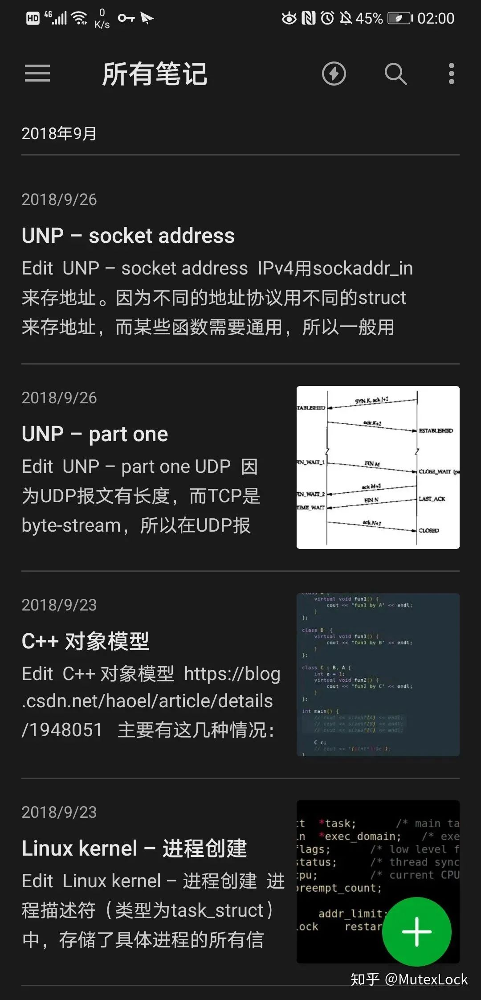
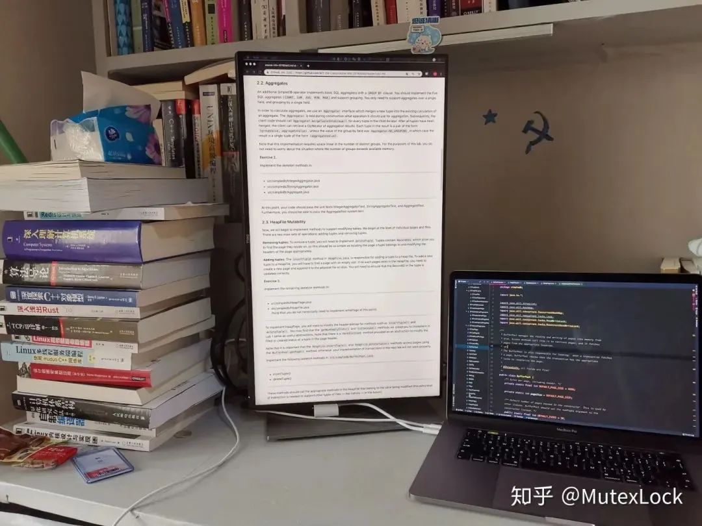
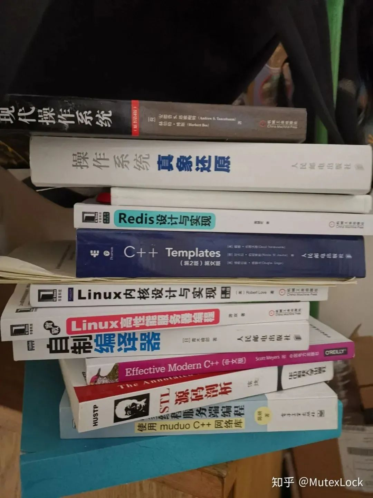
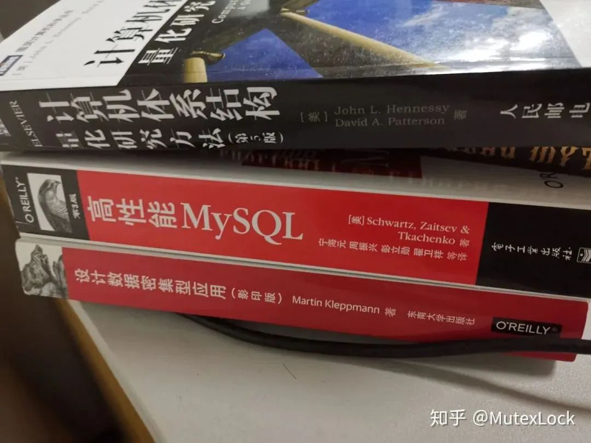
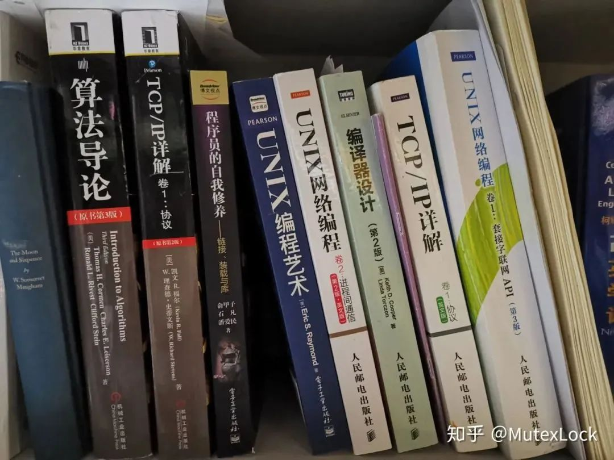
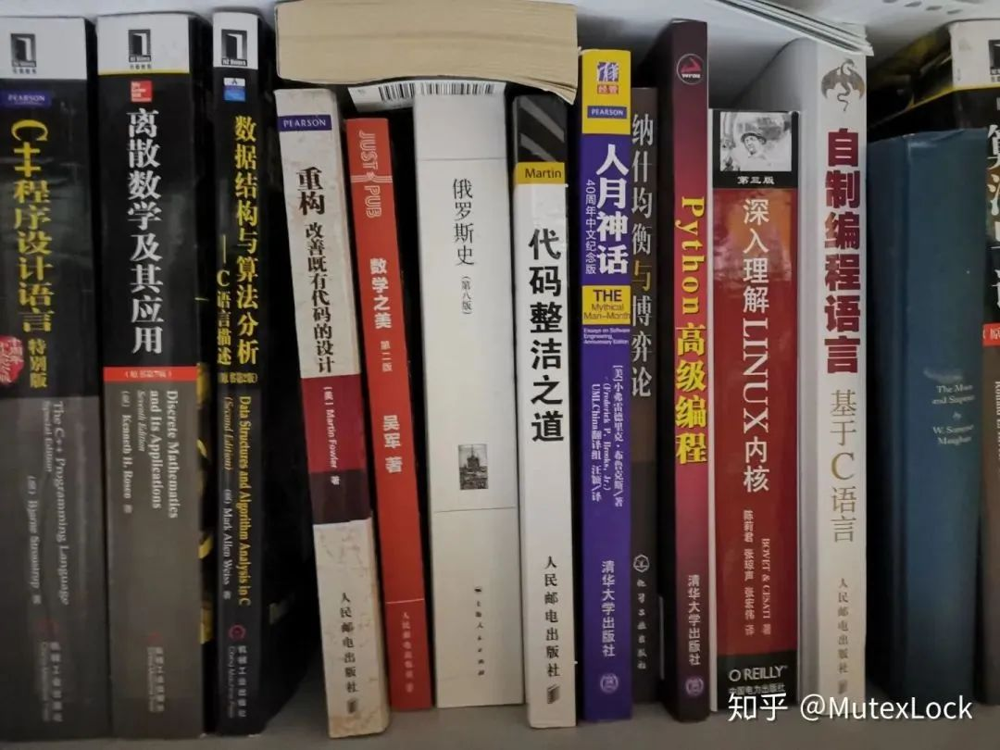
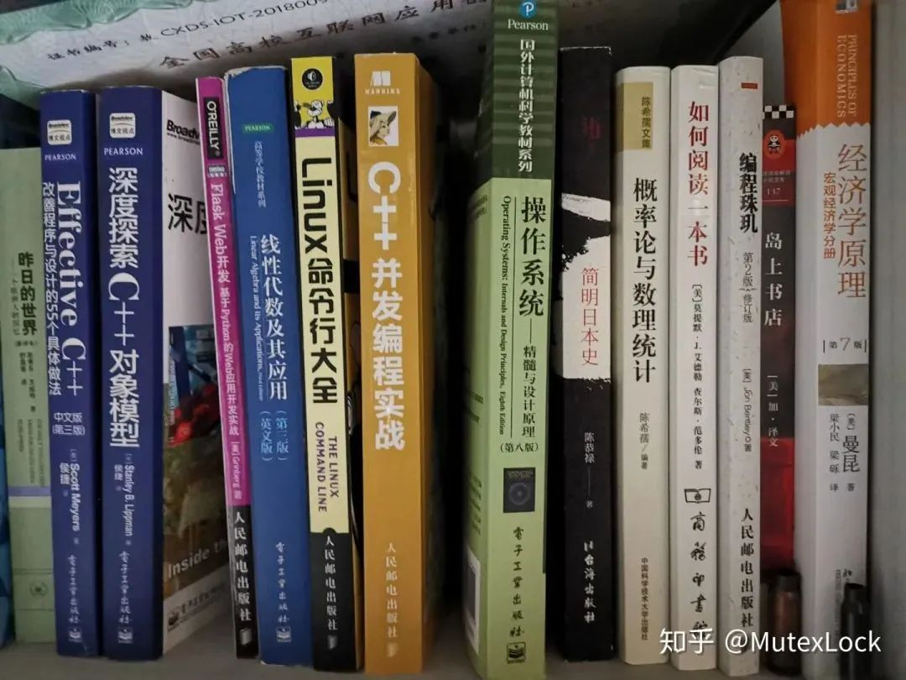
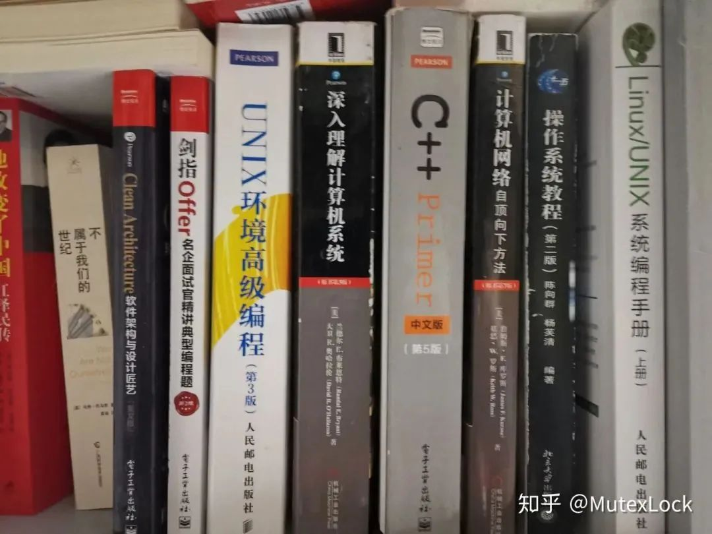
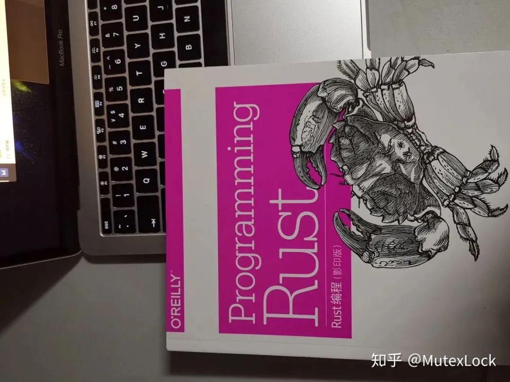

# 我的编程能力是从这时候开始突飞猛进的

点击关注👉 [鸭哥聊Java](javascript:void(0);) *2022-11-06 16:00* *发表于四川*

收录于合集#鸭哥聊Java32个

**鸭哥聊Java**

回复关键字：666 ，领取免费简历模板，Java面试题，Java编程视频等。本号内容涵盖Java源码，JVM源码，Dubbo源码，Spring源码，Spring Cloud微服务架构，分布式高并发架构技术，MySQL性能调优等。

94篇原创内容

公众号

知乎上的一个话题：**你的编程能力从什么时候开始突飞猛进？**

在这个话题下面有一篇回答写的不错，特意转载给大家看。

链接：*https://www.zhihu.com/question/356351510/answer/1148885728*

**正文如下**

在啃掉一本本计算机经典书籍和写下大量代码以后。

疫情原因回不去学校，作为一个马上毕业，即将入职腾讯的大四生，分享一下自己的学习历程吧。

本人在大学之前从未接触过编程，最开始的编程学习还是在高考完后，从书店买了本C Primer Plus，然后暑假开始啃，前前后后也就看了几十页。

**大一上的时候**，来到了华中师范大学，还没有转专业到计算机，一直在自学C语言和看一些计算机入门书籍（编码、计算机科学概论）。

当时也很迷茫，不知道以后道路如何，所以也学了一些杂七杂八的东西（前端 python啥的），所幸的是，当时坚持把C Primer Plus结结实实地精读了一遍，而且几乎练习题都做了，算是比较好的开端。

**大一下，转专业到计算机了**，开始自学数据结构，算法和C++，部分看完了 数据结构与算法分析，并且把书上的数据结构实现了一遍，记得当时五月份给自己的flag是看完C++ Primer，然后每天上课看，晚饭吃完后也跑去七号楼刷书，最后囫囵吞枣似的看完了大部分。

**大一暑假**，txr大佬给我说他面试通过了华科的联创团队Unique Studio，而且给我说他们团队都特别厉害，有些人在军训的时候就把C++ Primer给蹲着看完了，当时十分钦佩，幻想也能够进入贵团队。

于是打算在**大二上的时候，去报名他们的秋招**。所以，那个暑假在学校自学，呆了五十多天。最初，拿起一本APUE，看了一章后感觉看不懂又放下了。

然后，又拿起一本红色封面的算法第四版，这本书看完了，并且用C++把上面的算法都实现了一遍。另外，听知乎大佬说CSAPP是必看的神书，当时也懵懵懂懂地看了前面三章，做了lab。

为了学习 linux，还看了一本叫 linux 命令行大全的书。武汉的夏天很热，只能寂寞待在宿舍的我，打开了 LeetCode 的世界，写了一百多道题。

**大二上，十月**，忐忑迎来了联创的面试，前面两轮都过了，直到其特色的“熬夜测试”环节，因为实力不足+精力不足，测试败北，没有通过。

清晨七点，在回学校的公交车上思考自己不足，总结是知识体系仍然不够完全，而且深度也不够。后来这个学期有点“误入歧途”的意思，入了 Machine Learning 的坑，记得当时花了好几个月刷完西瓜书和吴恩达机器学习课程的讲义（真佩服当时的毅力，都是英文和公式推导），后来想了想，ML/DL这个东西有点玄学，于是毅然决定成为一名做工程的程序员。

总的来说，虽然这个学期的时间都投入到 ML 的学习中，没有学习工程方面的东西，只有用python写了一点好玩的爬虫，但是给了我以后坚定走工程方向的决心吧。

大二下，这个学期是打下计算机知识基础的关键时期。从知乎找了一系列书单，看完了CSAPP（做了lab，为了bomb lab还通宵了，强迫症想让自己把炸弹都拆了）、半本算法导论、effective C++、计算机网络系统方法（前三章）、部分TCP/IP详解等，做了一些项目，比如正则引擎（这个是参考了轮子哥的教程）等等，尝试写JSON库（未遂）。

其实，因为学校只是一个普通211，找到好工作的学长学姐先例很少，一直是没有信心自己能去大厂，直到当时了解到孟永康学长在春招收割了一系列offer后，才有了些许信心，相信自己如果能够像他那样努力，那么也能够找到好工作（感谢myk学长那时的鼓励和指导）。

所以，定下了一年把自己水平提升到能够在大三下春招的时候拿下大厂offer的目标。

**大二暑假和大三上也一直为这个目标奋斗**，补上了APUE、部分UNP、深度探索C++对象模型、STL源码剖析、操作系统概念、操作系统真象还原、Linux多线程服务端编程、部分C++ template、部分C++ Concurrency in Action等书籍。

然后，也一直没有放弃刷题，LeetCode写到了三百多道。同时也做了一些项目，跟着操作系统真象还原写的操作系统、简单的协程库，阅读了一些优秀的开源项目，SGI STL、muduo、libgo、libco等。

中途还对haskell产生过兴趣，打印了一本Learn Yourself Haskell For Great Good，看完后感觉坑太深，还是专注找工作吧，haskell对我一直都有很强的吸引力，但是这种也只能作为爱好吧。

另外，编译器也是有这种魔力，看了部分编译原理（龙书）、部分现代编译原理（虎书）和部分Engineering a Compiler，多次尝试写自己的编译器，多次未遂（不过现在有空了，在补上之前的烂尾项目）。当年的笔记哈哈：

**部分学习笔记：**

时间到了12月份，9号楼某个自习室内，txr大佬一直鼓励我去投简历找实习，本来我一直畏畏缩缩，对自己不太有信心，被鼓励后想着投就投吧。当时投了字节跳动和momenta的实习，面试都比较顺利，于是在大三上就在字节跳动开始了愉快的实习，比自己的计划早了大半年。

当时为了准备面试，看了好多牛客网的面经，查漏补缺式地补齐自己的知识盲区。

**大三下，基本都是在实习**，学习了很多工程实践上的东西，接触了go的技术栈，并且对devops和软件工程方面有了认知，包括代码管理、发布流程、微服务啥的。

然后实习的时候骑驴找马，找到了腾讯的暑期实习。因为这个时候没有了找工作的压力，所以开始学一些自己感兴趣的东西，包括Rust（至今水平还是不太行）、分布式系统（DDIA、MIT6.824等），零零散散学了点东西。

**大三暑假，腾讯实习了两个月**，开始学习kubernetes、各种中间件等实际业务用到的东西，这个时候就感觉拥有到扎实的计算机基础是最重要的东西。

最后，顺利拿到了腾讯转正和字节跳动的秋招offer，两家都给的比较高，选择了工作体验更喜欢的腾讯哈哈。

总的来说，学习计算机是需要积累的，花一两年时间啃下那些厚厚的经典书籍后，才能构建自己的知识体系，然后阅读大量优秀源码，做一些有趣的项目，编程能力就能突飞猛进啦。

现在回头来看，大学时光真是如此宝贵，这是人生中为数不多可以静心学习的一段时间，可以不用考虑任何其他事情，每天学习十多个小时。

**部分藏书：**

**近期技术热文：**

- [这几个已经淘汰的Java技术，请不要在继续学了！！！](http://mp.weixin.qq.com/s?__biz=Mzg3NDcwNjIwOQ==&mid=2247536609&idx=1&sn=dbad3e7ac0b1f47e36dbf575061a4f77&chksm=ceceabaff9b922b9e70139862b88738c4cbc9df3a8dd1167e380347c552f0279a8171c3ec71c&scene=21#wechat_redirect)
- [我把SpringBoot的banner换成了美女，老板说工作不饱和，建议安排加班...](http://mp.weixin.qq.com/s?__biz=Mzg3NDcwNjIwOQ==&mid=2247536469&idx=1&sn=72726d8123f76bc72f2998c5b3dd8d40&chksm=ceceab1bf9b9220d3f6b4122ba0c2742e5224b99519de8d7ebc024375f43e63c539f555a2327&scene=21#wechat_redirect)
- [真赞！IDEA中这么玩MyBatis，让编码速度飞起！](http://mp.weixin.qq.com/s?__biz=Mzg3NDcwNjIwOQ==&mid=2247536523&idx=1&sn=d04947d4e168276e562a598f9189729f&chksm=ceceabc5f9b922d3399902bdc1965a6022fb029cc0b140601170dd53317062f4158a992150f6&scene=21#wechat_redirect)
- [牛逼哄哄的 JD-hotkey ！](http://mp.weixin.qq.com/s?__biz=Mzg3NDcwNjIwOQ==&mid=2247536599&idx=1&sn=b0a4d30a3c9d8a1028008625c0ec95c1&chksm=ceceab99f9b9228f57d51e7bf3d475903e3f91a440f1b7bfeff9f3bbf814839eff07943f5a19&scene=21#wechat_redirect)

收录于合集 #鸭哥聊Java

 32个

下一篇这几个已经淘汰的Java技术，请不要在继续学了！！！

[阅读原文](javascript:;)

喜欢此内容的人还喜欢

优秀后端都应该具备的开发好习惯

 

捡田螺的小男孩

不喜欢

不看的原因

确定

- 内容质量低
- 不看此公众号

SpringBoot使用WebSocket实现即时消息

 

SpringBoot Cloud实战案例锦集

不喜欢

不看的原因

确定

- 内容质量低
- 不看此公众号

开源精选 | 基于Vue3.0的中后台前端解决方案

 

开源技术专栏

不喜欢

不看的原因

确定

- 内容质量低
- 不看此公众号

微信扫一扫
关注该公众号