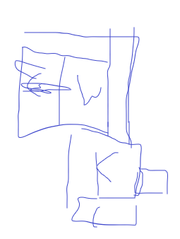

# 游戏流程

游戏采用双角色，分为男主(A)和小女孩(B)

## 一、序章

### 1.开头一段动画演出`Animation 1-1`

夜晚a在卧室睡觉，外面在下雨。一连串声响（开门走路东西掉落的声音），a醒了一下，电闪雷鸣一下，照亮整个房间，房间墙壁出现一个b的倒影。但是a没有注意，随后又继续睡着了。途中感觉到自己被拖走，眼睛勉强能看到几下，然后又失血过多闭上。醒来发现自己被绑在客厅椅子上，头被罩着（此时a已经头部受伤失忆状态）`表现失血过多状态`。随后a开始挣扎，听到一阵慌忙的脚步声音远去，a发出感叹。剧烈挣扎后椅子倒地，绳子松了，摘掉头套。然后游戏正式开始

### 2.出现任务`Task 1-1`

> 任务：序章-搞清楚自己的状况和所在环境

a知道自己头脑混乱且受到不明人的伤害，心里和恐惧和慌张，现在试图搞清楚现在的状况。目前可以处于客厅，可调查`卧室，走廊，厨房`。收集几个主要线索，可以不收集全触发下一个任务。部分位置参照面容设计jump scared比如关灯，关门，收音机，电视机等等。调查时如果触发卧室门打不开，开始找钥匙，提示任务2

### 3.出现任务`Task 1-2`

> 任务：进入卧室-也许我能弄清楚屋子的主人

找寻钥匙，然后通过查看到日记得知换过衣服，阳台不可以进入，但是可以在门口触发对话（玩家得知钥匙线索之后才能，并且拿在门口触发对话后，就可以拿起客厅摆放的`工艺品`）。使用道具砸坏阳台玻璃塑料门，进入阳台拿到`钥匙`。然后使用钥匙进入卧室，然后触发任务3

### 4.出现任务 `Task 1-3`

> 任务：调查卧室-获得线索

收集到几个关键道具，推断竟然发现自己就是这个屋子的主人，但是对眼前发生的一切还是一点记忆都没有。搜集到关键线索之后走到门口进入客厅，在走到接近直角的位置时候，一阵快速的奔跑，转过转角，看到储藏室们打开然后飞快的关上。前去调查储藏室触发任务

## 二、章节一

### 1.出现任务`Task 2-1`

> 任务：想办法进入储藏室

### 2.出现任务

后面进入小女孩b视角的时候，时间线刚好契合，a挣脱之后小女孩匆忙躲进卧室，并反锁。随后a进入卧室之后开始找东西，b不直到a已经失忆以为是在找她，她于是躲进柜子（有待考量），好在没有搜索这个地方。后面等a走出卧室，趁机往地下室躲藏。然后a调查完储藏室，得知事情全部真相以后，打算杀掉b。顺手拿起储藏室的斧子（有待考量），往地下室的们劈砍下去，然后时间定格，放大到男主的手表上，随即指针倒转，切到小女孩视角开始游戏的高潮部分。

### 书房和厨房到处视察

（视察关键道具报纸儿童失踪，一些神话相关摆件和画）

### 第一个触发道具

工具（视察物品后），音乐起，灵异现象：儿童尖叫奔跑，桌子倒地，解锁书柜互动。打开书柜，发现被木板挡住的洞口，提示寻找撬棍，撬棍位置在储物间，储物间锁住，需要寻找钥匙。

### 找到钥匙，进入储物间

拿到撬棍，撬开书柜木板，进入管道，寻找垫脚的（箱子），进入浴室，闲逛（可解锁浴室门，换衣间门需要钥匙开）。发现浴室天花板痕迹，拉下楼梯开关，进入小孩自己的暂离深渊的小秘密基地。

### 小孩天堂任务物品

一把藏到玩具熊的钥匙，用该钥匙解锁换衣间门，开门之前，触发灵异事件：小孩尖叫被拖拽。

### 开启储物间

开门后发现拖拽痕迹，储物间门口多出小孩儿鞋子，引导至储物间内地下室门。

{: id="20201210113339-q10xu1h" type="doc"}
